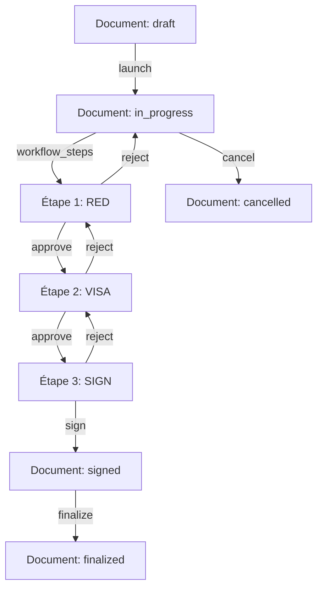
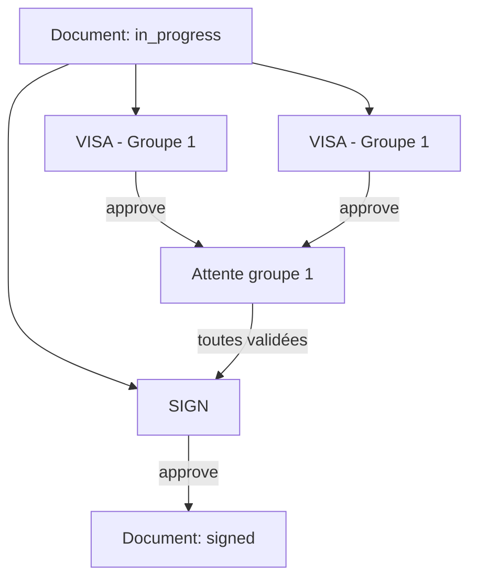

# Complexité 1: Gestion des Workflows (Circuits de Validation)
**Date:** 31 juillet 2026  
**Version:** 1.0  
**Parent:** [COMPLEXITES_Et_DEFIS_2026-07-31.md](../COMPLEXITES_Et_DEFIS_2026-07-31.md)

---

## 📋 Table des Matières

1. [Problématique Générale](#-problématique-générale)
2. [Modèles et Services Impliqués](#-modèles-et-services-impliqués)
3. [Scénarios Problématiques Détailés](#-scénarios-problématiques-détaillés)
4. [Solutions Proposées](#-solutions-proposées)
5. [Code d'Implémentation](#-code-dimplémentation)
6. [Tests Recommandés](#-tests-recommandés)
7. [Ressources et Références](#-ressources-et-références)

---

## 🎯 Problématique Générale

Le système de workflow de DocumentFlow est **au cœur de la logique métier** et présente plusieurs défis majeurs liés à la gestion des **circuits de validation multi-étapes**.

### 🎯 Complexités Identifiées

| Défis | Description | Impact Potentiel | Priorité |
|-------|-------------|------------------|----------|
| **Étapes parallèles** | Gestion des groupes d'étapes simultanées | Blocage du workflow, incohérence des états | ⭐⭐⭐⭐ |
| **Rejet et retour en arrière** | Annulation des validations suivantes | Données inconsistantes, étapes orphelines | ⭐⭐⭐⭐ |
| **Acteurs manquants** | Utilisateurs supprimés ou quittant l'entreprise | Workflow bloqué, étapes non assignées | ⭐⭐⭐ |
| **Synchronisation AASM ↔ WorkflowSteps** | Coordination entre état global et étapes individuelles | États incohérents, race conditions | ⭐⭐⭐⭐ |
| **Notifications en cascade** | Chaînes de notifications longues | Storm de broadcasts, latence | ⭐⭐ |

### 📊 Diagramme du Workflow Standard



### 📊 Diagramme avec Étapes Parallèles



---

## 🏗️ Modèles et Services Impliqués

### Modèles Principaux

#### Document (AASM State Machine)
```ruby
# app/models/document.rb
class Document < ApplicationRecord
  include AASM
  
  STATUSES = %w[draft in_progress signed finalized cancelled].freeze
  
  aasm column: :status do
    state :draft, initial: true
    state :in_progress
    state :signed
    state :finalized
    state :cancelled

    event :launch do
      transitions from: :draft, to: :in_progress
    end

    event :sign do
      transitions from: :in_progress, to: :signed, 
                 after: [ :freeze_document, :assign_reference_number ]
    end

    event :finalize do
      transitions from: :signed, to: :finalized
    end

    event :cancel do
      transitions from: [ :draft, :in_progress, :signed ], to: :cancelled
    end
  end
  
  has_many :workflow_steps, dependent: :destroy
end
```

#### WorkflowStep
```ruby
# app/models/workflow_step.rb
class WorkflowStep < ApplicationRecord
  ROLES = %w[RED VISA SIGN EXP].freeze
  STATUSES = %w[pending approved rejected skipped].freeze

  belongs_to :document
  belongs_to :actor, class_name: "User", optional: true
  
  # Support des étapes parallèles
  boolean :is_parallel, default: false
  integer :parallel_group
  
  scope :pending, -> { where(status: "pending") }
  scope :approved, -> { where(status: "approved") }
  scope :rejected, -> { where(status: "rejected") }
  scope :skipped, -> { where(status: "skipped") }
  scope :ordered, -> { order(:order) }
end
```

### Services (light-service)

#### Organizers
```ruby
# app/services/workflow/approve_step_organizer.rb
module Workflow
  class ApproveStepOrganizer < ApplicationService
    workflow_steps Actions::ValidateActorCanApprove,
                   Actions::ApproveStep,
                   Actions::AdvanceWorkflow,
                   Actions::NotifyNextActor,
                   Actions::BroadcastSidebarToNextActor
  end
end
```

```ruby
# app/services/workflow/reject_step_organizer.rb
module Workflow
  class RejectStepOrganizer < ApplicationService
    workflow_steps Actions::ValidateActorCanReject,
                   Actions::RejectStep,
                   Actions::ReturnToPreviousStep,
                   Actions::NotifyPreviousActor,
                   Actions::BroadcastSidebarToPreviousActor
  end
end
```

```ruby
# app/services/workflow/launch_organizer.rb
module Documents
  class LaunchOrganizer < ApplicationService
    workflow_steps Actions::ValidateHasCircuit,
                   Actions::ValidateHasSignStep,
                   Actions::ValidateHasMainFile,
                   Actions::LaunchDocument,
                   Actions::NotifyFirstActor,
                   Actions::BroadcastSidebarToFirstActor
  end
end
```

---

## ⚠️ Scénarios Problématiques Détailés

### 🎯 Cas 1: Étapes Parallèles Non Terminées

**Contexte :**
Un template de circuit contient des étapes parallèles :
```ruby
# CircuitTemplateStep records:
# 1. VISA (order: 1, is_parallel: true, parallel_group: 1)
# 2. VISA (order: 2, is_parallel: true, parallel_group: 1)
# 3. SIGN (order: 3, is_parallel: false, parallel_group: nil)
```

**Scénario :**
1. Les deux étapes VISA sont créées pour un document
2. Alice valide la première VISA
3. Bob **ne valide pas encore** la deuxième VISA
4. Le workflow **ne progresse pas** vers SIGN

**Problème :**
- Comment savoir que **le groupe parallèle est terminé** ?
- Faut-il attendre que **toutes les étapes du groupe** soient validées ?
- Que faire si une étape du groupe est **rejetée** ?

**Code Actuel (Incomplet) :**
```ruby
# app/services/workflow/actions/advance_workflow.rb
class AdvanceWorkflow < ApplicationAction
  expects :document
  
  executed do |ctx|
    # TODO: Check if all parallel steps in current group are approved
    next_step = ctx.document.workflow_steps.ordered.pending.first
    # ...
  end
end
```

**Risques :**
- ✅ **Blocage du workflow** : Si une étape parallèle est oubliée
- ✅ **Incohérence** : Document peut passer à l'étape suivante alors qu'une étape parallèle est toujours pendante
- ✅ **Expérience utilisateur** : Les utilisateurs ne savent pas pourquoi le workflow ne progresse pas

---

### 🎯 Cas 2: Rejet et Annulation des Étapes Suivantes

**Scénario :**
1. Document a 5 étapes: [RED, VISA1, VISA2, SIGN, EXP]
2. VISA1 et VISA2 sont **déjà validées**
3. SIGN est en cours (assignée à Charlie)
4. Charlie **rejette** SIGN

**Problème :**
- Faut-il **annuler les validations de VISA1 et VISA2** ?
- Comment **réactiver les étapes précédentes** ?
- Que faire si VISA1 était validée par une personne **qui a quitté l'entreprise** ?

**Code Actuel (Partiel) :**
```ruby
# app/services/workflow/actions/return_to_previous_step.rb
class ReturnToPreviousStep < ApplicationAction
  expects :document, :current_step
  
  executed do |ctx|
    # TODO: Cancel all subsequent steps
    # TODO: Reactivate previous step
    # TODO: Handle case where previous step actor is no longer available
  end
end
```

**Risques :**
- ❌ **Données inconsistantes** : Étapes marquées `approved` alors que le workflow a reculé
- ❌ **Notifications erronées** : Utilisateurs notifiés pour des étapes qui n'existent plus
- ❌ **Blocage** : Si l'acteur de l'étape précédente n'est plus disponible

---

### 🎯 Cas 3: Acteur Disponible (User Supprimé ou Inactif)

**Scénario :**
1. Une étape est assignée à Alice (`actor_id = 123`)
2. Alice **quitte l'entreprise** → son compte est désactivé
3. Le workflow **reste bloqué** sur cette étape

**Problème :**
- Comment **détecter** qu'un acteur n'est plus disponible ?
- Comment **réassigner** l'étape automatiquement ?
- Qui a **l'autorité** pour réassigner (admin, owner, manager) ?

**Code Actuel (Problématique) :**
```ruby
# app/models/workflow_step.rb
belongs_to :actor, class_name: "User", optional: true
# → actor_id peut être NULL !
```

**Risques :**
- ❌ **Étapes orphelines** : Workflow bloqué indéfiniment
- ❌ **Perte de traçabilité** : Impossible de savoir qui aurait dû valider
- ❌ **Mauvaise UX** : Les autres utilisateurs ne comprennent pas pourquoi le workflow est bloqué

---

### 🎯 Cas 4: Incohérence AASM ↔ WorkflowSteps

**Scénario :**
1. Document est en `in_progress`
2. Toutes les étapes sont validées **sauf la dernière (SIGN)**
3. Un bug fait que **SIGN est marquée `approved` manuellement**
4. Le document **devrait passer en `signed`** mais ne le fait pas

**Problème :**
- Le `Document#status` et les `WorkflowStep#status` **ne sont pas synchronisés**
- Comment **détecter et corriger** ces incohérences ?
- Comment **empêcher** que cela arrive ?

**Risques :**
- ❌ **Race conditions** : Deux validations simultanées → état incohérent
- ❌ **Données corrompues** : Document `signed` mais avec des étapes `pending`
- ❌ **Difficulté de debug** : Impossible de retrouver l'état réel du workflow

---

### 🎯 Cas 5: Workflows Longs et Notifications en Cascade

**Scénario :**
1. Un workflow a **20 étapes** avec 20 acteurs différents
2. Chaque validation déclenche :
   - Notification email
   - Broadcast Turbo Stream
   - Mise à jour du cache
3. Le 20ème acteur valide → **20 notifications** sont envoyées en cascade

**Problème :**
- **Storm de notifications** : Le serveur passe son temps à notifier
- **Latence** : Les notifications mettent du temps à arriver
- **Charge serveur** : Base de données et cache sollicités

**Risques :**
- ⚠️ **Performance dégradée** : Temps de réponse élevé
- ⚠️ **Timeout** : Certains broadcasts peuvent échouer
- ⚠️ **Mauvaise UX** : Notifications qui arrivent avec du retard

---

## 💡 Solutions Proposées

| Problème | Solution | Complexité | Impact |
|----------|----------|------------|--------|
| Étapes parallèles | Implémenter `parallel_group_approved?` | ⭐⭐ | Haut |
| Rejet et retour | Transaction atomique + rollback | ⭐⭐⭐ | Haut |
| Acteur manquant | Réassignation automatique + notification | ⭐⭐ | Moyen |
| Synchronisation | Observer pattern + validation croisée | ⭐⭐ | Haut |
| Cascade notifications | Throttling + batch processing | ⭐ | Moyen |

---

## 🔧 Code d'Implémentation

### ✅ Solution 1: Gestion des Étapes Parallèles

#### Étape 1: Ajouter des méthodes au modèle WorkflowStep
```ruby
# app/models/workflow_step.rb
class WorkflowStep < ApplicationRecord
  # ...
  
  # Trouve toutes les étapes du même groupe parallèle
  def parallel_group_steps
    document.workflow_steps.where(parallel_group: parallel_group)
  end

  # Vérifie si toutes les étapes du groupe sont validées
  def parallel_group_approved?
    parallel_group_steps.where(status: "approved").count == parallel_group_steps.count
  end

  # Vérifie si une étape du groupe a été rejetée
  def parallel_group_rejected?
    parallel_group_steps.where(status: "rejected").exists?
  end
  
  # Vérifie si le groupe parallèle est prêt à passer à l'étape suivante
  def parallel_group_ready?
    parallel_group_approved? && !parallel_group_rejected?
  end
end
```

#### Étape 2: Modifier le service AdvanceWorkflow
```ruby
# app/services/workflow/actions/advance_workflow.rb
class AdvanceWorkflow < ApplicationAction
  expects :document, :current_step
  promises :workflow_advanced

  executed do |ctx|
    document = ctx.document
    current_step = ctx.current_step
    
    # Si l'étape courante fait partie d'un groupe parallèle
    if current_step.is_parallel && current_step.parallel_group.present?
      # Vérifier si toutes les étapes du groupe sont validées
      unless current_step.parallel_group_approved?
        ctx.fail!("Not all parallel steps in group #{current_step.parallel_group} are approved")
        return ctx
      end
      
      # Vérifier qu'aucune étape du groupe n'a été rejetée
      if current_step.parallel_group_rejected?
        ctx.fail!("A step in parallel group #{current_step.parallel_group} was rejected")
        return ctx
      end
    end
    
    # Trouver l'étape suivante
    next_step = document.workflow_steps
      .where(""order" > ?", current_step.order)
      .ordered
      .pending
      .first
    
    if next_step.nil?
      # Toutes les étapes sont validées, passer au statut suivant
      if document.in_progress?
        # Vérifier si la prochaine étape est SIGN
        sign_step = document.workflow_steps.where(role: "SIGN").approved.first
        if sign_step || document.workflow_steps.where(role: "SIGN").pending.first
          ctx.workflow_advanced = true
        else
          ctx.fail!("No SIGN step found, cannot finalize")
        end
      end
    else
      # Activer l'étape suivante
      next_step.update!(status: "pending")
      ctx[:next_step] = next_step
      ctx.workflow_advanced = true
    end
    
    ctx
  end
end
```

#### Étape 3: Modifier l'organizer LaunchOrganizer
```ruby
# app/services/documents/launch_organizer.rb
module Documents
  class LaunchOrganizer < ApplicationService
    workflow_steps Actions::ValidateHasCircuit,
                   Actions::ValidateHasSignStep,
                   Actions::ValidateHasMainFile,
                   Actions::LaunchDocument,
                   Actions::SetFirstStepAsPending,
                   Actions::NotifyFirstActor,
                   Actions::BroadcastSidebarToFirstActor
  end
end
```

#### Étape 4: Ajouter SetFirstStepAsPending
```ruby
# app/services/documents/actions/set_first_step_as_pending.rb
module Documents
  module Actions
    class SetFirstStepAsPending < ApplicationAction
      expects :document

      executed do |ctx|
        document = ctx.document
        first_step = document.workflow_steps.ordered.first
        
        if first_step
          first_step.update!(status: "pending")
          ctx[:first_step] = first_step
        else
          ctx.fail!("No workflow steps found")
        end
        
        ctx
      end
    end
  end
end
```

---

### ✅ Solution 2: Rejet et Retour en Arrière

#### Étape 1: Implémenter ReturnToPreviousStep
```ruby
# app/services/workflow/actions/return_to_previous_step.rb
class ReturnToPreviousStep < ApplicationAction
  expects :document, :current_step
  promises :returned_to_previous

  executed do |ctx|
    document = ctx.document
    current_step = ctx.current_step
    
    # Transaction pour garantir l'atomicité
    WorkflowStep.transaction do
      # 1. Annuler toutes les étapes suivantes (si elles existent)
      subsequent_steps = document.workflow_steps
        .where(""order" > ?", current_step.order)
        .where(status: ["approved", "pending"])
      
      subsequent_steps.update_all(status: "skipped")
      
      # 2. Trouver l'étape précédente
      previous_step = document.workflow_steps
        .where(""order" < ?", current_step.order)
        .ordered
        .last
      
      if previous_step.nil?
        # Retour au draft si c'est la première étape
        document.update!(status: "draft")
        current_step.update!(status: "pending")
      else
        # Réactiver l'étape précédente
        previous_step.update!(status: "pending")
        current_step.update!(status: "rejected")
      end
      
      ctx.returned_to_previous = true
      ctx[:previous_step] = previous_step
    end
    
    ctx
  end
end
```

#### Étape 2: Valider la cohérence du workflow
```ruby
# app/models/document.rb
# Dans la classe Document
after_create :validate_workflow_consistency

def validate_workflow_consistency
  if in_progress? && workflow_steps.pending.none?
    # Si aucune étape n'est pendante mais qu'il y a des étapes, il y a un problème
    errors.add(:base, "Workflow inconsistency: no pending steps but document is in_progress")
    throw :abort
  end
end

# Méthode pour vérifier la cohérence
before_save :ensure_workflow_consistency

def ensure_workflow_consistency
  if status_changed?
    case status
    when "in_progress"
      if workflow_steps.pending.none? && workflow_steps.any?
        errors.add(:base, "Cannot be in_progress without pending steps")
        throw :abort
      end
    when "signed"
      if workflow_steps.where(role: "SIGN").approved.none?
        errors.add(:base, "Cannot be signed without SIGN step approved")
        throw :abort
      end
    when "finalized"
      if workflow_steps.pending.any?
        errors.add(:base, "Cannot be finalized with pending steps")
        throw :abort
      end
    end
  end
end
```

---

### ✅ Solution 3: Réassignation Automatique des Acteurs

#### Étape 1: Ajouter des méthodes au modèle WorkflowStep
```ruby
# app/models/workflow_step.rb
# Ajouter un callback pour détecter les acteurs invalides
before_validation :validate_actor_availability

def validate_actor_availability
  if actor_id.present? && actor.nil?
    errors.add(:actor, "assigned user does not exist")
  elsif actor_id.present? && actor && !actor.active?
    errors.add(:actor, "assigned user is not active")
  end
end

# Méthode pour réassigner automatiquement
def reassign_to_available_user!
  entity = document.entity
  
  # 1. Essayer de trouver un admin ou owner de l'entité
  new_actor = entity.entity_users
    .where(role: ["owner", "admin"])
    .joins(:user)
    .where(users: { id: EntityUser.active.select(:user_id) })
    .first
    &.user
  
  if new_actor
    update!(actor: new_actor)
    return true
  end
  
  # 2. Essayer de trouver un member du même département
  department = document.department
  if department
    new_actor = entity.entity_users
      .where(role: "member")
      .joins(:user, :entity_user_departments)
      .where(
        users: { id: EntityUser.active.select(:user_id) },
        entity_user_departments: { department_id: department.id }
      )
      .first
      &.user
    
    if new_actor
      update!(actor: new_actor)
      return true
    end
  end
  
  # 3. Essayer n'importe quel member de l'entité
  new_actor = entity.entity_users
    .where(role: "member")
    .joins(:user)
    .where(users: { id: EntityUser.active.select(:user_id) })
    .first
    &.user
  
  if new_actor
    update!(actor: new_actor)
    return true
  end
  
  false
end
```

#### Étape 2: Modifier ValidateActorCanApprove
```ruby
# app/services/workflow/actions/validate_actor_can_approve.rb
class ValidateActorCanApprove < ApplicationAction
  expects :current_user, :workflow_step

  executed do |ctx|
    step = ctx.workflow_step
    user = ctx.current_user
    
    # Vérifier que l'utilisateur est bien l'acteur de l'étape
    unless step.actor == user
      return fail_with!(ctx, "You are not the assigned actor for this step", :permission_error)
    end
    
    # Vérifier que l'utilisateur est actif
    unless user.active?
      # Essayer de réassigner
      if step.reassign_to_available_user!
        return fail_with!(ctx, "You are no longer active. This step has been reassigned to another user.", :reassigned)
      else
        return fail_with!(ctx, "You are no longer active and no other user is available for reassignment.", :no_manager)
      end
    end
    
    # Vérifier que l'étape est bien en pending
    unless step.pending?
      return fail_with!(ctx, "This step is not in pending status", :invalid_status)
    end
    
    # Vérifier que le document n'est pas gelé
    if step.document.is_frozen?
      return fail_with!(ctx, "This document is frozen and cannot be modified", :frozen_document)
    end
    
    ctx
  end
end
```

---

### ✅ Solution 4: Synchronisation AASM ↔ WorkflowSteps

#### Étape 1: Ajouter des callbacks au modèle Document
```ruby
# app/models/document.rb
# Callback après sauvegarde pour synchroniser les états
after_save :sync_status_with_workflow_steps

def sync_status_with_workflow_steps
  if status_changed?
    case status
    when "in_progress"
      # S'assurer qu'il y a au moins une étape pending
      if workflow_steps.pending.none?
        workflow_steps.first&.update!(status: "pending")
      end
    when "signed"
      # S'assurer que toutes les étapes sauf SIGN sont validées
      non_sign_steps = workflow_steps.where.not(role: "SIGN")
      if non_sign_steps.where(status: "pending").exists?
        errors.add(:base, "Cannot sign: some non-SIGN steps are still pending")
        throw :abort
      end
    when "finalized"
      # S'assurer que toutes les étapes sont validées
      if workflow_steps.where(status: "pending").exists?
        errors.add(:base, "Cannot finalize: some steps are still pending")
        throw :abort
      end
    when "cancelled"
      # Marquer toutes les étapes comme skipped
      workflow_steps.where(status: "pending").update_all(status: "skipped")
    end
  end
end

# Méthode pour mettre à jour le statut en fonction des étapes
def update_status_from_workflow!
  if workflow_steps.pending.none?
    if workflow_steps.where(role: "SIGN").approved.exists?
      sign! if in_progress?
    elsif workflow_steps.where(role: "SIGN").pending.exists?
      # Attendre la signature
    else
      finalize! if signed?
    end
  end
end
```

#### Étape 2: Ajouter un callback au modèle WorkflowStep
```ruby
# app/models/workflow_step.rb
# Callback après sauvegarde pour déclencher la synchronisation
after_commit :trigger_document_status_update, if: :status_changed?

def trigger_document_status_update
  document.update_status_from_workflow! if document.status.in?(%w[in_progress signed])
end
```

---

### ✅ Solution 5: Throttling des Notifications

#### Étape 1: Créer un service de broadcast avec throttling
```ruby
# app/services/shared/actions/broadcast_sidebar_to_user.rb
module Shared
  module Actions
    class BroadcastSidebarToUser < ApplicationAction
      expects :user
      
      executed do |ctx|
        user = ctx.user
        cache_key = "last_sidebar_broadcast:#{user.id}"
        
        # Throttling: maximum 1 broadcast par seconde par utilisateur
        last_broadcast = Rails.cache.read(cache_key)
        if last_broadcast && Time.current - last_broadcast < 1.second
          log_action(ctx, "[Turbo] Skipping sidebar broadcast for user #{user.id} (throttled)")
          return ctx
        end
        
        # Broadcast avec Turbo Streams
        Turbo::StreamsChannel.broadcast_replace_later_to(
          user,
          :sidebar_counts,
          partial: "shared/sidebar_counts",
          locals: { user: user }
        )
        
        # Mettre à jour le cache
        Rails.cache.write(cache_key, Time.current, expires_in: 1.second)
        
        ctx
      end
    end
  end
end
```

#### Étape 2: Modifier les services pour utiliser le throttling
```ruby
# app/services/workflow/actions/notify_next_actor.rb
module Workflow
  module Actions
    class NotifyNextActor < ApplicationAction
      expects :document, :next_actor

      executed do |ctx|
        # ... (logique de notification)
        
        # Utiliser le broadcast avec throttling
        Shared::Actions::BroadcastSidebarToUser.executed(user: ctx.next_actor)
        
        ctx
      end
    end
  end
end
```

---

## 🧪 Tests Recommandés

### Tests Unitaires (RSpec)

#### Test des Étapes Parallèles
```ruby
# spec/models/workflow_step_spec.rb
RSpec.describe WorkflowStep do
  describe "parallel group management" do
    let(:document) { create(:document, :in_progress) }
    let!(:step1) { create(:workflow_step, document: document, role: "VISA", order: 1, is_parallel: true, parallel_group: 1) }
    let!(:step2) { create(:workflow_step, document: document, role: "VISA", order: 2, is_parallel: true, parallel_group: 1) }
    let!(:step3) { create(:workflow_step, document: document, role: "SIGN", order: 3) }

    describe "#parallel_group_approved?" do
      it "returns false when not all steps in group are approved" do
        step1.approve!
        expect(step1.parallel_group_approved?).to be false
        expect(step2.parallel_group_approved?).to be false
      end

      it "returns true when all steps in group are approved" do
        step1.approve!
        step2.approve!
        expect(step1.parallel_group_approved?).to be true
        expect(step2.parallel_group_approved?).to be true
      end
    end

    describe "#parallel_group_rejected?" do
      it "returns false when no steps in group are rejected" do
        expect(step1.parallel_group_rejected?).to be false
      end

      it "returns true when any step in group is rejected" do
        step1.reject!
        expect(step1.parallel_group_rejected?).to be true
        expect(step2.parallel_group_rejected?).to be true
      end
    end

    describe "#parallel_group_ready?" do
      it "returns false when not all steps are approved" do
        step1.approve!
        expect(step1.parallel_group_ready?).to be false
      end

      it "returns false when a step is rejected" do
        step1.approve!
        step2.reject!
        expect(step1.parallel_group_ready?).to be false
      end

      it "returns true when all steps are approved" do
        step1.approve!
        step2.approve!
        expect(step1.parallel_group_ready?).to be true
      end
    end
  end
end
```

#### Test du Rejet et Retour en Arrière
```ruby
# spec/services/workflow/approve_step_organizer_spec.rb
RSpec.describe Workflow::ApproveStepOrganizer do
  let(:document) { create(:document, :in_progress) }
  let(:user) { create(:user) }
  let(:step) { create(:workflow_step, document: document, actor: user, role: "VISA") }

  describe "parallel steps" do
    let!(:step2) { create(:workflow_step, document: document, role: "VISA", order: 2, is_parallel: true, parallel_group: 1) }

    it "fails when not all parallel steps are approved" do
      result = described_class.call(workflow_step: step, current_user: user)
      expect(result).to be_failure
      expect(result.message).to include("Not all parallel steps")
    end

    it "succeeds when all parallel steps are approved" do
      step2.approve!
      result = described_class.call(workflow_step: step, current_user: user)
      expect(result).to be_success
    end
  end

  describe "rejection and rollback" do
    let!(:step2) { create(:workflow_step, document: document, role: "SIGN", order: 2) }
    let!(:step3) { create(:workflow_step, document: document, role: "EXP", order: 3) }

    before do
      step2.approve!
      step3.approve!
    end

    it "cancels subsequent steps when rejected" do
      expect(step2.reload.status).to eq("approved")
      expect(step3.reload.status).to eq("approved")
      
      result = Workflow::RejectStepOrganizer.call(
        document: document,
        workflow_step: step,
        current_user: user
      )
      
      expect(result).to be_success
      expect(step2.reload.status).to eq("skipped")
      expect(step3.reload.status).to eq("skipped")
      expect(step.reload.status).to eq("rejected")
    end

    it "reactivates previous step when rejected" do
      step2.reject!
      
      result = Workflow::RejectStepOrganizer.call(
        document: document,
        workflow_step: step2,
        current_user: user
      )
      
      expect(result).to be_success
      expect(step.reload.status).to eq("pending")
      expect(step2.reload.status).to eq("rejected")
    end
  end
end
```

#### Test de la Réassignation
```ruby
# spec/services/workflow/actions/validate_actor_can_approve_spec.rb
RSpec.describe Workflow::Actions::ValidateActorCanApprove do
  let(:user) { create(:user) }
  let(:other_user) { create(:user) }
  let(:step) { create(:workflow_step, actor: user) }

  context "when user is the assigned actor" do
    it "succeeds" do
      ctx = { current_user: user, workflow_step: step }
      result = described_class.executed(ctx)
      expect(result).to be_success
    end
  end

  context "when user is not the assigned actor" do
    it "fails with permission error" do
      ctx = { current_user: other_user, workflow_step: step }
      result = described_class.executed(ctx)
      expect(result).to be_failure
      expect(result[:permission_error]).to be_present
    end
  end

  context "when actor is inactive" do
    let(:inactive_user) { create(:user, :inactive) }
    let(:step) { create(:workflow_step, actor: inactive_user) }
    let(:manager) { create(:user, :admin) }

    before do
      # Créer une entité et des EntityUser pour le test
      entity = create(:entity)
      create(:entity_user, entity: entity, user: inactive_user, role: "member", status: "suspended")
      create(:entity_user, entity: entity, user: manager, role: "admin", status: "active")
      step.document.update!(entity: entity)
    end

    it "reassigns to manager and fails with reassigned message" do
      ctx = { current_user: inactive_user, workflow_step: step }
      result = described_class.executed(ctx)
      
      expect(result).to be_failure
      expect(result[:reassigned]).to be_present
      expect(step.reload.actor).to eq(manager)
    end
  end

  context "when no manager is available" do
    let(:inactive_user) { create(:user, :inactive) }
    let(:step) { create(:workflow_step, actor: inactive_user) }

    it "fails with no manager message" do
      ctx = { current_user: inactive_user, workflow_step: step }
      result = described_class.executed(ctx)
      
      expect(result).to be_failure
      expect(result[:no_manager]).to be_present
    end
  end
end
```

#### Test de la Synchronisation
```ruby
# spec/models/document_spec.rb
RSpec.describe Document do
  let(:entity) { create(:entity) }
  let(:user) { create(:user) }

  before do
    create(:entity_user, entity: entity, user: user, role: "member")
  end

  describe "status synchronization with workflow steps" do
    let(:document) { create(:document, entity: entity, status: :in_progress) }

    it "fails when trying to sign without all steps approved" do
      create(:workflow_step, document: document, role: "VISA", status: "pending")
      create(:workflow_step, document: document, role: "SIGN", status: "pending")
      
      expect { document.sign! }.not_to change(document, :status)
      expect(document.errors[:base]).to include("some non-SIGN steps are still pending")
    end

    it "succeeds when all non-SIGN steps are approved" do
      create(:workflow_step, document: document, role: "VISA", status: "approved")
      create(:workflow_step, document: document, role: "SIGN", status: "pending")
      
      expect { document.sign! }.to change(document, :status).from("in_progress").to("signed")
    end

    it "fails when trying to finalize with pending steps" do
      create(:workflow_step, document: document, role: "VISA", status: "pending")
      
      expect { document.finalize! }.not_to change(document, :status)
      expect(document.errors[:base]).to include("some steps are still pending")
    end
  end

  describe "automatic status update from workflow steps" do
    let(:document) { create(:document, entity: entity, status: :in_progress) }

    it "updates status when all steps are approved" do
      create(:workflow_step, document: document, role: "SIGN", status: "pending")
      sign_step = create(:workflow_step, document: document, role: "SIGN", status: "approved")
      
      # Simuler la validation de la dernière étape
      sign_step.update!(status: "approved")
      
      expect(document.reload.status).to eq("signed")
    end
  end
end
```

### Tests d'Intégration

```ruby
# spec/requests/workflow_steps_spec.rb
RSpec.describe "WorkflowSteps", type: :request do
  let(:entity) { create(:entity) }
  let(:user) { create(:user) }
  let(:document) { create(:document, :in_progress, entity: entity, created_by: user) }

  before do
    sign_in user
    create(:entity_user, entity: entity, user: user, role: "member")
  end

  describe "POST /workflow_steps/:id/approve" do
    let(:step) { create(:workflow_step, document: document, actor: user) }

    context "with parallel steps" do
      let!(:step2) { create(:workflow_step, document: document, role: "VISA", order: 2, is_parallel: true, parallel_group: 1) }

      it "does not advance when other parallel steps are pending" do
        post approve_entity_document_workflow_step_path(entity, document, step)
        
        expect(response).to redirect_to(entity_document_path(entity, document))
        expect(flash[:alert]).to include("Not all parallel steps")
        expect(step.reload.status).to eq("pending")
      end

      it "advances when all parallel steps are approved" do
        step2.approve!
        post approve_entity_document_workflow_step_path(entity, document, step)
        
        expect(response).to redirect_to(entity_document_path(entity, document))
        expect(flash[:notice]).to include("Step approved")
        expect(step.reload.status).to eq("approved")
      end
    end

    context "with rejection" do
      let!(:step2) { create(:workflow_step, document: document, role: "SIGN", order: 2) }
      let!(:step3) { create(:workflow_step, document: document, role: "EXP", order: 3) }

      before do
        step2.approve!
        step3.approve!
      end

      it "cancels subsequent steps when rejected" do
        post reject_entity_document_workflow_step_path(entity, document, step)
        
        expect(response).to redirect_to(entity_document_path(entity, document))
        expect(flash[:notice]).to include("Step rejected")
        expect(step2.reload.status).to eq("skipped")
        expect(step3.reload.status).to eq("skipped")
        expect(step.reload.status).to eq("rejected")
      end
    end
  end
end
```

---

## 🎯 Résumé des Actions Clés

| Action | Fichier | Description |
|--------|---------|-------------|
| `parallel_group_approved?` | `app/models/workflow_step.rb` | Vérifie si toutes les étapes du groupe sont validées |
| `parallel_group_rejected?` | `app/models/workflow_step.rb` | Vérifie si une étape du groupe a été rejetée |
| `parallel_group_ready?` | `app/models/workflow_step.rb` | Vérifie si le groupe est prêt à passer à l'étape suivante |
| `AdvanceWorkflow` | `app/services/workflow/actions/advance_workflow.rb` | Gère l'avancement avec support des étapes parallèles |
| `ReturnToPreviousStep` | `app/services/workflow/actions/return_to_previous_step.rb` | Gère le retour en arrière avec annulation des étapes suivantes |
| `reassign_to_available_user!` | `app/models/workflow_step.rb` | Réassigne automatiquement à un utilisateur disponible |
| `sync_status_with_workflow_steps` | `app/models/document.rb` | Synchronise l'état AASM avec les WorkflowSteps |
| `BroadcastSidebarToUser` | `app/services/shared/actions/broadcast_sidebar_to_user.rb` | Broadcast avec throttling |

---

## 📚 Ressources et Références

### Documentation Connexe
- [light-service Documentation](https://github.com/adomokos/light-service)
- [AASM Documentation](https://github.com/aasm/aasm)
- [ActiveRecord Transactions](https://guides.rubyonrails.org/active_record_transaction.html)
- [Turbo Streams](https://turbo.hotwired.dev/handbook/streams)

### Bonnes Pratiques
- Toujours utiliser des **transactions** pour les opérations multi-étapes
- Utiliser des **callbacks after_commit** pour les opérations qui dépendent de la persistance
- **Throttler les broadcasts** pour éviter les storms de notifications
- **Valider la cohérence** des données à chaque changement d'état

---

**Prochaine étape :** [Complexité 2: Données Polymorphiques](../02_polymorphic_associations.md) 🚀
