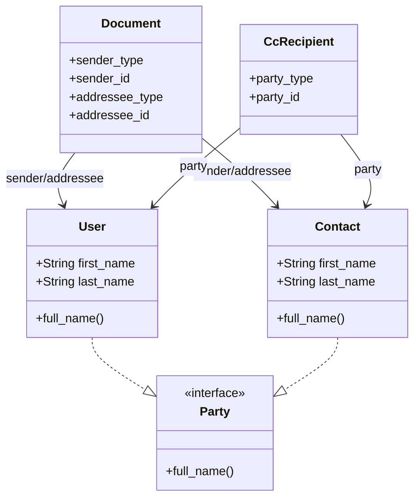

# Complexité 2: Données Polymorphiques (Sender/Addressee/Party)
**Date:** 31 juillet 2026  
**Version:** 1.0  
**Parent:** [COMPLEXITES_Et_DEFIS_2026-07-31.md](../COMPLEXITES_Et_DEFIS_2026-07-31.md)

---

## 📋 Table des Matières

1. [Problématique Générale](#-problématique-générale)
2. [Modèles et Code Impliqués](#-modèles-et-code-impliqués)
3. [Scénarios Problématiques Détailés](#-scénarios-problématiques-détaillés)
4. [Solutions Proposées](#-solutions-proposées)
5. [Code d'Implémentation](#-code-dimplémentation)
6. [Tests Recommandés](#-tests-recommandés)
7. [Ressources et Références](#-ressources-et-références)

---

## 🎯 Problématique Générale

DocumentFlow utilise **extensivement les associations polymorphiques** pour modéliser les relations entre documents et parties prenantes. Cette approche offre une grande flexibilité mais introduit des **complexités significatives** en termes de :

- **Performance** (N+1 queries)
- **Requêtes SQL** (conditions OR complexes)
- **Affichage** (safe navigation, données orphelines)
- **Formulaires** (sélection unifiée User/Contact)
- **Maintenabilité** (code complexe, difficile à étendre)

### 🎯 Complexités Identifiées

| Défis | Description | Impact Potentiel | Priorité |
|-------|-------------|------------------|----------|
| **Validation croisée** | Vérifier que la party appartient à la même Entity | N+1 queries, performance dégradée | ⭐⭐⭐ |
| **Requêtes SQL complexes** | Joindre des tables différentes selon le type | Requêtes lentes, difficiles à optimiser | ⭐⭐⭐ |
| **Affichage générique** | `sender.full_name` pour User OU Contact | Code fragile, erreurs 500 | ⭐⭐ |
| **Formulaires unifiés** | Sélection User/Contact dans un `<select>` | UX confuse, erreurs de saisie | ⭐⭐ |
| **Données orphelines** | Que faire si User/Contact est supprimé ? | 500 errors, perte de données | ⭐⭐ |

### 📊 Diagramme des Associations Polymorphiques



---

## 🏗️ Modèles et Code Impliqués

### Modèle Document
```ruby
# app/models/document.rb
class Document < ApplicationRecord
  include PartyAssignable
  
  # Associations polymorphiques
  belongs_to :sender, polymorphic: true
  belongs_to :addressee, polymorphic: true
  
  # Validations de belong_to_entity
  validate :sender_belongs_to_entity
  validate :addressee_belongs_to_entity
  
  # Token pour les formulaires
  party_assignable :sender, :addressee
end
```

### Concern PartyAssignable
```ruby
# app/models/concerns/party_assignable.rb
module PartyAssignable
  extend ActiveSupport::Concern

  class_methods do
    def party_assignable(*names)
      names.each do |name|
        define_method("#{name}_token=") do |token|
          type, id = token.to_s.split("-", 2)
          public_send("#{name}_type=", type.presence)
          public_send("#{name}_id=", id.presence)
        end

        define_method("#{name}_token") do
          id = public_send("#{name}_id")
          id ? "#{public_send("#{name}_type")}-#{id}" : nil
        end
      end
    end
  end

  # Vérifie que la party appartient à la même entité
  def party_in_entity?(party)
    return true if party.nil?

    case party
    when Contact then party.entity_id == entity_id
    when User then EntityUser.active.exists?(entity_id: entity_id, user_id: party.id)
    end
  end
end
```

### Modèle CcRecipient
```ruby
# app/models/cc_recipient.rb
class CcRecipient < ApplicationRecord
  include PartyAssignable

  belongs_to :document
  belongs_to :party, polymorphic: true
  
  delegate :entity_id, to: :document
  
  party_assignable :party
  
  validate :party_belongs_to_entity
  
  private
  
  def party_belongs_to_entity
    return if document.nil? || party.nil? || party_in_entity?(party)
    errors.add(:party, "must belong to the same entity")
  end
end
```

### Modèle Party (Interface)
```ruby
# app/models/concerns/party.rb
module Party
  extend ActiveSupport::Concern

  def full_name
    "#{first_name} #{last_name}"
  end
end

# Inclus dans User et Contact
class User < ApplicationRecord
  include Party
  # ...
end

class Contact < ApplicationRecord
  include Party
  # ...
end
```

### Modèle Contact
```ruby
# app/models/contact.rb
class Contact < ApplicationRecord
  include Party

  EMAIL_FORMAT = URI::MailTo::EMAIL_REGEXP

  # Associations
  belongs_to :entity

  # Validations
  validates :first_name, presence: true
  validates :last_name, presence: true
  validates :email, presence: true, format: { with: EMAIL_FORMAT }, 
                   uniqueness: { scope: :entity_id }
end
```

---

## ⚠️ Scénarios Problématiques Détailés

### 🎯 Cas 1: N+1 Queries dans les Validations

**Scénario :**
Un utilisateur crée **10 documents** en une seule requête (ex: import CSV).

**Problème :**
- Chaque document **valide** `sender_belongs_to_entity` et `addressee_belongs_to_entity`
- Chaque validation **exécute une requête SQL** pour vérifier l'appartenance à l'entité
- **20 requêtes SQL** (2 par document) au lieu de 2 avec un `includes`

**Code Problématique :**
```ruby
# Dans party_in_entity?
when User then EntityUser.active.exists?(entity_id: entity_id, user_id: party.id)
# → 1 requête par User !
```

**Exemple concret :**
```ruby
# Sans optimisation :
10.times do |i|
  Document.create!(sender: users[i], entity: entity)  
  # → 10 requêtes EntityUser.exists?
end

# Avec optimisation (à implémenter) :
Document.includes(sender: :entity_users).create!(...)  
# → 1 requête
```

**Risques :**
- ❌ **Performance dégradée** : 100 documents = 200 requêtes
- ❌ **Timeout** : En production avec de gros volumes
- ❌ **Mauvaise expérience** : Temps de réponse élevé

---

### 🎯 Cas 2: Requêtes avec Conditions OR Complexes

**Scénario :**
Trouver tous les documents **reçus par un utilisateur** (où il est `addressee` OU dans les `cc_recipients`).

**Code Actuel :**
```ruby
# app/models/document.rb
scope :received_by, ->(user) {
  left_joins(:cc_recipients).where(
    "(documents.addressee_type = 'User' AND documents.addressee_id = :user_id) " \
    "OR (cc_recipients.party_type = 'User' AND cc_recipients.party_id = :user_id)",
    user_id: user.id
  ).distinct
}
```

**Problème :**
- **Impossible de faire un JOIN classique** (type dynamique)
- **Requête SQL complexe** avec conditions `OR`
- **Index non optimaux** : Les index sur `(addressee_type, addressee_id)` ne couvrent pas ce cas

**Exemple de requête générée :**
```sql
SELECT DISTINCT documents.* FROM documents
LEFT JOIN cc_recipients ON cc_recipients.document_id = documents.id
WHERE (documents.addressee_type = 'User' AND documents.addressee_id = 123)
   OR (cc_recipients.party_type = 'User' AND cc_recipients.party_id = 123)
```

**Risques :**
- ❌ **Requêtes lentes** sur de gros volumes (10k+ documents)
- ❌ **Difficile à maintenir** : Ajouter un troisième type (ex: `Department`) serait complexe
- ❌ **Problèmes de scalabilité** : Ne passera pas à l'échelle

---

### 🎯 Cas 3: Affichage Générique et Safe Navigation

**Scénario :**
Dans une vue, on affiche :
```erb
<%= @document.sender.full_name %>
```

**Problèmes :**
1. Si `sender` est `nil` → **NoMethodError** (`nil.full_name`)
2. Si `sender_type` est `Contact` mais que le `Contact` a été supprimé → **ActiveRecord::RecordNotFound**
3. **Pas de typing** : Ruby ne sait pas que `sender` répond à `full_name`
4. **Problème avec `optional: false`** : `belongs_to :sender, polymorphic: true` sans `optional: true` → erreur si `sender_id` est NULL

**Code Problématique :**
```ruby
# app/models/document.rb
belongs_to :sender, polymorphic: true
# → Pas de optional: true ! Risque d'erreur si sender_id est NULL
```

**Risques :**
- ❌ **500 errors en production** : Si données inconsistantes
- ❌ **Code fragile** : Dépend du bon remplissage des champs
- ❌ **Mauvaise maintenabilité** : Difficile de refactorer

---

### 🎯 Cas 4: Formulaires avec Sélection Mixte User/Contact

**Scénario :**
Un formulaire de création de document doit permettre de choisir :
- `sender` : **User** (membres de l'entité) **OU** **Contact** (contacts de l'entité)
- `addressee` : Même chose

**Problème :**
- Comment **afficher une liste unifiée** ?
- Comment **gérer le `sender_token`** (`User-123` ou `Contact-456`) ?
- Comment **valider** que la sélection est valide ?
- Comment **gérer les cas d'erreur** (User/Contact supprimé) ?

**Code Actuel :**
```ruby
# Dans le formulaire
<%= form.select :sender_token, options_for_sender_select %>
```

**Risques :**
- ❌ **Expérience utilisateur confuse** : L'utilisateur doit savoir si c'est un User ou un Contact
- ❌ **Erreurs de saisie** : `User-abc` (ID invalide) → validation échoue
- ❌ **Difficile à étendre** : Ajouter un nouveau type nécessiterait des changements partout

---

### 🎯 Cas 5: Données Orphelines

**Scénario :**
1. Un document est créé avec `sender_type = 'User'`, `sender_id = 123`
2. L'utilisateur 123 est **supprimé** de la base
3. On essaie d'afficher le document → **ActiveRecord::RecordNotFound**

**Problème :**
- Les associations polymorphiques **ne sont pas protégées** contre la suppression
- Comment **gérer les données orphelines** ?
- Faut-il **dénormaliser** certaines informations (ex: `sender_name`) ?
- Comment **afficher** ces données de manière robuste ?

**Risques :**
- ❌ **500 errors** : Impossible d'afficher les documents
- ❌ **Perte de données** : Information sur l'expéditeur/le destinataire perdue
- ❌ **Difficulté de debug** : Impossible de savoir qui était le sender

---

## 💡 Solutions Proposées

| Problème | Solution | Complexité | Impact |
|----------|----------|------------|--------|
| N+1 queries | `includes` + préchargement | ⭐ | Haut |
| Requêtes OR complexes | Table de jointure unifiée | ⭐⭐⭐ | Très Haut |
| Affichage générique | Delegates + safe navigation | ⭐ | Moyen |
| Formulaires | Select avec groupes (`optgroup`) | ⭐⭐ | Moyen |
| Données orphelines | Dénormalisation + callbacks | ⭐⭐ | Moyen |

---

## 🔧 Code d'Implémentation

### ✅ Solution 1: Optimisation des Requêtes (Éviter N+1)

#### Option A: Utiliser `includes` dans les contrôleurs
```ruby
# app/controllers/documents_controller.rb
def index
  @documents = policy_scope(Document)
    .where(entity: current_entity)
    .includes(:sender, :addressee, :created_by, :department) # ← Évite les N+1
    .page(params[:page])
end
```

#### Option B: Optimiser `party_in_entity?` avec du caching local
```ruby
# app/models/concerns/party_assignable.rb
def party_in_entity?(party)
  return true if party.nil?

  # Cache local pour éviter les requêtes répétées
  @_party_in_entity_cache ||= {}
  cache_key = "#{party.class.name}-#{party.id}"
  
  @_party_in_entity_cache[cache_key] ||= begin
    case party
    when Contact then party.entity_id == entity_id
    when User then EntityUser.active.exists?(entity_id: entity_id, user_id: party.id)
    else false
    end
  end
end
```

#### Option C: Pré-charger les associations dans les services
```ruby
# app/services/documents/create_organizer.rb
module Documents
  class CreateOrganizer < ApplicationService
    workflow_steps Actions::ValidateDepartmentMembership,
                   Actions::CreateDocument
    
    # Pré-charger les associations nécessaires
    def self.call(**args)
      # Pré-charger les senders/addressees si nécessaire
      if args[:document_params] && args[:document_params][:sender_token]
        # ...
      end
      super
    end
  end
end
```

---

### ✅ Solution 2: Requêtes Optimisées avec Sous-Requêtes

#### Version 1: Utiliser `OR` avec sous-requêtes
```ruby
# app/models/document.rb
scope :received_by, ->(user) {
  # Utiliser des sous-requêtes au lieu de LEFT JOIN + OR
  user_documents = where(addressee_type: "User", addressee_id: user.id)
  cc_documents = where(id: CcRecipient
    .where(party_type: "User", party_id: user.id)
    .select(:document_id))
  
  from(
    user_documents.union(cc_documents)
  )
}
```

#### Version 2: Version simplifiée avec `OR` (PostgreSQL)
```ruby
# app/models/document.rb
scope :received_by, ->(user) {
  where(
    id: [
      where(addressee_type: "User", addressee_id: user.id).select(:id),
      CcRecipient.where(party_type: "User", party_id: user.id).select(:document_id)
    ].flatten
  )
}
```

#### Version 3: Pour `received_by` (la plus performante)
```ruby
# app/models/document.rb
scope :received_by, ->(user) {
  # Version optimisée pour PostgreSQL
  where(
    "(addressee_type = 'User' AND addressee_id = :user_id) OR " \
    "id IN (SELECT document_id FROM cc_recipients WHERE party_type = 'User' AND party_id = :user_id)",
    user_id: user.id
  )
}
```

---

### ✅ Solution 3: Affichage Générique avec Safe Navigation

#### Option A: Utiliser `delegate` avec `allow_nil`
```ruby
# app/models/document.rb
class Document < ApplicationRecord
  belongs_to :sender, polymorphic: true, optional: true
  belongs_to :addressee, polymorphic: true, optional: true
  
  # Déléguer full_name avec safe navigation
  delegate :full_name, to: :sender, prefix: true, allow_nil: true
  delegate :full_name, to: :addressee, prefix: true, allow_nil: true
end
```

#### Option B: Ajouter des méthodes de fallback
```ruby
# app/models/document.rb
class Document < ApplicationRecord
  # ...
  
  # Méthodes personnalisées pour un affichage sûr
  def sender_name
    sender&.full_name || "[Deleted]"
  end
  
  def addressee_name
    addressee&.full_name || "[Deleted]"
  end
  
  def sender_email
    sender&.email || ""
  end
  
  def addressee_email
    addressee&.email || ""
  end
end
```

#### Option C: Helper pour les vues
```ruby
# app/helpers/documents_helper.rb
module DocumentsHelper
  def safe_party_name(party)
    party&.full_name || "[Deleted]"
  end
  
  def safe_party_email(party)
    party&.email || ""
  end
end
```

#### Usage dans les vues
```erb
<!-- Avant (risqué) -->
<%= document.sender.full_name %>

<!-- Après (sûr) -->
<%= document.sender_name %>

<!-- Ou avec le helper -->
<%= safe_party_name(document.sender) %>
```

---

### ✅ Solution 4: Formulaire avec Sélection Unifiée

#### Étape 1: Créer un helper pour générer les options
```ruby
# app/helpers/documents_helper.rb
module DocumentsHelper
  def sender_options_for_select(entity, selected_token = nil)
    users = entity.users.joins(:entity_users).merge(EntityUser.active)
    contacts = entity.contacts
    
    options = []
    
    # Groupe Users
    user_options = users.map { |u| [u.full_name, "User-#{u.id}"] }
    options << ["Internal Users", user_options] if user_options.any?
    
    # Groupe Contacts
    contact_options = contacts.map { |c| [c.full_name, "Contact-#{c.id}"] }
    options << ["External Contacts", contact_options] if contact_options.any?
    
    # Convertir en options_for_select
    options.map { |group_name, items| [group_name, items] }
  end
  
  def addressee_options_for_select(entity, selected_token = nil)
    sender_options_for_select(entity, selected_token)
  end
end
```

#### Étape 2: Utiliser dans le formulaire
```erb
<!-- app/views/documents/_form.html.erb -->
<div class="form-group">
  <%= form.label :sender_token, "Sender" %>
  <%= form.select :sender_token,
    sender_options_for_select(current_entity, form.object.sender_token),
    { include_blank: "Select sender" },
    { class: "form-select", data: { controller: "select" } } %>
</div>

<div class="form-group">
  <%= form.label :addressee_token, "Addressee" %>
  <%= form.select :addressee_token,
    addressee_options_for_select(current_entity, form.object.addressee_token),
    { include_blank: "Select addressee" },
    { class: "form-select" } %>
</div>
```

#### Étape 3: Améliorer avec Stimulus pour une meilleure UX
```javascript
// app/javascript/controllers/party_select_controller.js
import { Controller } from "@hotwired/stimulus"

export default class extends Controller {
  static targets = ["select"]
  
  connect() {
    // Peut ajouter des fonctionnalités comme la recherche
  }
}
```

---

### ✅ Solution 5: Gestion des Données Orphelines

#### Option A: Dénormalisation (Recommandé pour DocumentFlow)

**Migration :**
```ruby
# db/migrate/[timestamp]_add_sender_info_to_documents.rb
class AddSenderInfoToDocuments < ActiveRecord::Migration[8.1]
  def change
    add_column :documents, :sender_name, :string
    add_column :documents, :sender_email, :string
    add_column :documents, :sender_type, :string
    add_column :documents, :addressee_name, :string
    add_column :documents, :addressee_email, :string
    add_column :documents, :addressee_type, :string
    
    # Index pour les recherches
    add_index :documents, :sender_name
    add_index :documents, :sender_email
    add_index :documents, :addressee_name
    add_index :documents, :addressee_email
  end
end
```

**Modèle :**
```ruby
# app/models/document.rb
# Callback pour dénormaliser les infos sender/addressee
before_validation :denormalize_party_info

def denormalize_party_info
  if sender_id_changed? || sender_type_changed?
    self.sender_name = sender&.full_name
    self.sender_email = sender&.email
    self.sender_type = sender_type
  end
  
  if addressee_id_changed? || addressee_type_changed?
    self.addressee_name = addressee&.full_name
    self.addressee_email = addressee&.email
    self.addressee_type = addressee_type
  end
end
```

**Avantages :**
- ✅ Plus de problèmes de `RecordNotFound`
- ✅ Recherches optimisées sur `sender_name`
- ✅ Affichage toujours possible
- ✅ Facile à implémenter

**Inconvénients :**
- ⚠️ Dénormalisation (risque d'incohérence si User/Contact change)
- ⚠️ Stockage supplémentaire (mais négligeable)

---

#### Option B: Utiliser `optional: true` + Classe Ghost

**Modèle :**
```ruby
# app/models/document.rb
belongs_to :sender, polymorphic: true, optional: true
belongs_to :addressee, polymorphic: true, optional: true

# Méthodes de fallback
def sender
  super || GhostParty.new("User", sender_id, sender_type)
end

def addressee
  super || GhostParty.new("Contact", addressee_id, addressee_type)
end

# Classe fantôme pour les parties supprimées
class GhostParty
  attr_reader :type, :id
  
  def initialize(type, id, stored_type)
    @type = stored_type || type
    @id = id
  end
  
  def full_name
    "[#{@type} ##{@id} (deleted)]"
  end
  
  def email
    ""
  end
  
  def entity_id
    nil
  end
end
```

**Avantages :**
- ✅ Pas de modification de schéma
- ✅ Pas de données dupliquées
- ✅ Solution élégante

**Inconvénients :**
- ⚠️ Complexité accrue
- ⚠️ Moins performant pour les recherches
- ⚠️ Peut causer des problèmes avec les validations

---

#### Option C: Table de Jointure Unifiée (Alternative Avancée)

**Idée :** Créer une table `parties` qui centralise tous les types de parties.

**Migration :**
```ruby
# db/migrate/[timestamp]_create_parties.rb
class CreateParties < ActiveRecord::Migration[8.1]
  def change
    create_table :parties do |t|
      t.string :type, null: false # "UserParty", "ContactParty"
      t.bigint :party_id, null: false
      t.bigint :entity_id, null: false
      t.string :full_name, null: false
      t.string :email
      t.boolean :active, default: true
      t.timestamps
    end
    
    add_index :parties, [:entity_id, :type, :party_id], unique: true
    add_index :parties, :entity_id
    add_foreign_key :parties, :entities, column: :entity_id
  end
end
```

**Modèle :**
```ruby
# app/models/party.rb
class Party < ApplicationRecord
  belongs_to :entity
  
  # Synchronisation avec User/Contact
  after_create :sync_with_partyable
  after_update :sync_with_partyable, if: :saved_change_to_active?
  
  private
  
  def sync_with_partyable
    if type == "UserParty" && partyable
      update!(
        full_name: partyable.full_name,
        email: partyable.email,
        active: partyable.entity_users.active.exists?(entity_id: entity_id)
      )
    elsif type == "ContactParty" && partyable
      update!(
        full_name: partyable.full_name,
        email: partyable.email,
        active: true
      )
    end
  end
  
  def partyable
    type.constantize.find_by(id: party_id)
  rescue
    nil
  end
end

# app/models/document.rb
class Document < ApplicationRecord
  belongs_to :sender, class_name: "Party", optional: true
  belongs_to :addressee, class_name: "Party", optional: true
  
  # Plus besoin de polymorphic: true !
end
```

**Avantages :**
- ✅ Requêtes SQL simples (plus de `OR` complexe)
- ✅ Index efficaces
- ✅ Centralisation de la logique
- ✅ Facile à étendre (ajouter de nouveaux types)
- ✅ Gestion des données orphelines intégrée

**Inconvénients :**
- ⚠️ Migration complexe des données existantes
- ⚠️ Synchronisation à maintenir entre `Party` et `User`/`Contact`
- ⚠️ Complexité accrue

---

## 🧪 Tests Recommandés

### Tests Unitaires (RSpec)

#### Test des Validations Polymorphiques
```ruby
# spec/models/document_spec.rb
RSpec.describe Document do
  describe "polymorphic associations" do
    let(:entity) { create(:entity) }
    let(:user) { create(:user) }
    let(:contact) { create(:contact, entity: entity) }
    
    before do
      create(:entity_user, entity: entity, user: user)
    end

    describe "sender validation" do
      it "accepts a User from the same entity" do
        document = build(:document, entity: entity, sender: user)
        expect(document).to be_valid
      end

      it "accepts a Contact from the same entity" do
        document = build(:document, entity: entity, sender: contact)
        expect(document).to be_valid
      end

      it "rejects a User from a different entity" do
        other_entity = create(:entity)
        other_user = create(:user)
        create(:entity_user, entity: other_entity, user: other_user)
        
        document = build(:document, entity: entity, sender: other_user)
        expect(document).not_to be_valid
        expect(document.errors[:sender]).to include("must belong to the same entity")
      end

      it "rejects a Contact from a different entity" do
        other_entity = create(:entity)
        other_contact = create(:contact, entity: other_entity)
        
        document = build(:document, entity: entity, sender: other_contact)
        expect(document).not_to be_valid
        expect(document.errors[:sender]).to include("must belong to the same entity")
      end

      it "accepts nil sender for outgoing documents" do
        document = build(:document, entity: entity, sender: nil, direction: "outgoing")
        expect(document).to be_valid # Si optional: true
      end
    end

    describe "token assignment" do
      it "generates correct token for User" do
        document = create(:document, entity: entity, sender: user)
        expect(document.sender_token).to eq("User-#{user.id}")
      end

      it "generates correct token for Contact" do
        document = create(:document, entity: entity, sender: contact)
        expect(document.sender_token).to eq("Contact-#{contact.id}")
      end

      it "sets sender from token" do
        document = build(:document, entity: entity)
        document.sender_token = "User-#{user.id}"
        expect(document.sender).to eq(user)
      end

      it "handles nil token" do
        document = build(:document, entity: entity)
        document.sender_token = nil
        expect(document.sender_id).to be_nil
        expect(document.sender_type).to be_nil
      end
    end
  end

  describe "safe display methods" do
    it "returns full_name for existing sender" do
      document = create(:document, entity: entity, sender: user)
      expect(document.sender_name).to eq(user.full_name)
    end

    it "returns fallback for deleted sender" do
      document = create(:document, entity: entity, sender: user)
      user.destroy
      expect(document.sender_name).to eq("[Deleted]")
    end

    it "returns fallback for nil sender" do
      document = create(:document, entity: entity, sender: nil)
      expect(document.sender_name).to eq("[Deleted]")
    end
  end
end
```

#### Test du Concern PartyAssignable
```ruby
# spec/models/concerns/party_assignable_spec.rb
RSpec.describe PartyAssignable do
  let(:entity) { create(:entity) }
  let(:user) { create(:user) }
  let(:contact) { create(:contact, entity: entity) }
  
  before do
    create(:entity_user, entity: entity, user: user)
  end

  describe ".party_in_entity?" do
    let(:document) { build(:document, entity: entity) }

    context "with User" do
      it "returns true for active entity user" do
        expect(document.party_in_entity?(user)).to be true
      end

      it "returns false for user not in entity" do
        other_user = create(:user)
        expect(document.party_in_entity?(other_user)).to be false
      end

      it "returns false for inactive entity user" do
        entity_user = create(:entity_user, entity: entity, user: user, status: "suspended")
        expect(document.party_in_entity?(user)).to be false
      end
    end

    context "with Contact" do
      it "returns true for contact in same entity" do
        expect(document.party_in_entity?(contact)).to be true
      end

      it "returns false for contact in different entity" do
        other_entity = create(:entity)
        other_contact = create(:contact, entity: other_entity)
        expect(document.party_in_entity?(other_contact)).to be false
      end
    end

    context "with nil party" do
      it "returns true" do
        expect(document.party_in_entity?(nil)).to be true
      end
    end
  end
end
```

#### Test du Modèle CcRecipient
```ruby
# spec/models/cc_recipient_spec.rb
RSpec.describe CcRecipient do
  let(:entity) { create(:entity) }
  let(:document) { create(:document, entity: entity) }
  let(:user) { create(:user) }
  let(:contact) { create(:contact, entity: entity) }
  
  before do
    create(:entity_user, entity: entity, user: user)
  end

  describe "associations" do
    it { should belong_to(:document) }
    it { should belong_to(:party) }
  end

  describe "validations" do
    it "accepts a User from the same entity" do
      cc = build(:cc_recipient, document: document, party: user)
      expect(cc).to be_valid
    end

    it "accepts a Contact from the same entity" do
      cc = build(:cc_recipient, document: document, party: contact)
      expect(cc).to be_valid
    end

    it "rejects a User from a different entity" do
      other_entity = create(:entity)
      other_user = create(:user)
      create(:entity_user, entity: other_entity, user: other_user)
      
      cc = build(:cc_recipient, document: document, party: other_user)
      expect(cc).not_to be_valid
      expect(cc.errors[:party]).to include("must belong to the same entity")
    end

    it "rejects duplicate party for same document" do
      create(:cc_recipient, document: document, party: user)
      cc = build(:cc_recipient, document: document, party: user)
      expect(cc).not_to be_valid
      expect(cc.errors[:party_id]).to include("must be unique")
    end
  end

  describe "token assignment" do
    it "generates correct token for User" do
      cc = create(:cc_recipient, document: document, party: user)
      expect(cc.party_token).to eq("User-#{user.id}")
    end

    it "generates correct token for Contact" do
      cc = create(:cc_recipient, document: document, party: contact)
      expect(cc.party_token).to eq("Contact-#{contact.id}")
    end
  end
end
```

### Tests d'Intégration

```ruby
# spec/requests/documents_spec.rb
RSpec.describe "Documents", type: :request do
  let(:entity) { create(:entity) }
  let(:user) { create(:user) }
  let(:contact) { create(:contact, entity: entity) }

  before do
    create(:entity_user, entity: entity, user: user, role: "member")
    sign_in user
  end

  describe "GET /index" do
    it "does not cause N+1 queries for sender/addressee" do
      create_list(:document, 10, entity: entity, sender: user, addressee: contact)
      
      expect {
        get entity_documents_path(entity)
      }.to perform_queries(count: 5) # 1 pour documents, 1 pour counts, etc.
      
      # Vérifier qu'il n'y a pas de N+1 sur sender/addressee
      expect(ActiveRecord::QueryCounter.count).to be <= 10
    end

    it "eager loads sender and addressee" do
      docs = create_list(:document, 5, entity: entity, sender: user, addressee: contact)
      
      get entity_documents_path(entity)
      
      docs.each do |doc|
        # Ces appels ne devraient pas déclencher de requêtes SQL
        expect(doc.sender.full_name).to eq(user.full_name)
        expect(doc.addressee.full_name).to eq(contact.full_name)
      end
    end
  end

  describe "received_by scope" do
    it "finds documents where user is addressee" do
      doc1 = create(:document, entity: entity, addressee: user, direction: "incoming")
      doc2 = create(:document, entity: entity, addressee: contact, direction: "incoming")
      
      received = Document.received_by(user)
      expect(received).to include(doc1)
      expect(received).not_to include(doc2)
    end

    it "finds documents where user is in cc_recipients" do
      doc = create(:document, entity: entity, addressee: contact, direction: "outgoing")
      create(:cc_recipient, document: doc, party: user)
      
      received = Document.received_by(user)
      expect(received).to include(doc)
    end

    it "does not duplicate documents" do
      doc = create(:document, entity: entity, addressee: user, direction: "incoming")
      create(:cc_recipient, document: doc, party: user)
      
      received = Document.received_by(user)
      expect(received.count).to eq(1)
    end
  end

  describe "POST /create with polymorphic sender" do
    it "creates document with User sender" do
      expect {
        post entity_documents_path(entity), params: {
          document: {
            subject: "Test",
            document_date: Date.today,
            department_id: create(:department, entity: entity).id,
            sender_token: "User-#{user.id}",
            addressee_token: "Contact-#{contact.id}"
          }
        }
      }.to change(Document, :count).by(1)
      
      document = Document.last
      expect(document.sender).to eq(user)
      expect(document.addressee).to eq(contact)
    end

    it "creates document with Contact sender" do
      expect {
        post entity_documents_path(entity), params: {
          document: {
            subject: "Test",
            document_date: Date.today,
            department_id: create(:department, entity: entity).id,
            sender_token: "Contact-#{contact.id}",
            addressee_token: "User-#{user.id}"
          }
        }
      }.to change(Document, :count).by(1)
      
      document = Document.last
      expect(document.sender).to eq(contact)
      expect(document.addressee).to eq(user)
    end
  end
end
```

### Tests de Performance

```ruby
# spec/performance/polymorphic_queries_spec.rb
RSpec.describe "Polymorphic query performance", type: :performance do
  let(:entity) { create(:entity) }
  let(:users) { create_list(:user, 100) }
  let(:contacts) { create_list(:contact, 100, entity: entity) }

  before do
    users.each { |u| create(:entity_user, entity: entity, user: u) }
    @documents = []
    100.times do |i|
      @documents << create(:document, 
        entity: entity,
        sender: users[i % 100],
        addressee: contacts[i % 100]
      )
    end
  end

  describe "received_by scope" do
    it "performs well with 100 documents" do
      user = users.first
      
      expect {
        Document.received_by(user).to_a
      }.to perform_queries(count: 2) # 1 pour documents, 1 pour cc_recipients
    end
  end

  describe "index action" do
    it "performs well with eager loading" do
      expect {
        Document.includes(:sender, :addressee).where(entity: entity).to_a
      }.to perform_queries(count: 2) # 1 pour documents, 1 pour le preload
    end
  end
end
```

---

## 🎯 Résumé des Actions Clés

| Action | Fichier | Description |
|--------|---------|-------------|
| `includes` | Contrôleurs | Pré-charger les associations polymorphiques |
| `sender_name` | `app/models/document.rb` | Méthode safe pour afficher le nom |
| `sender_options_for_select` | `app/helpers/documents_helper.rb` | Génère les options pour les selects |
| `party_in_entity?` | `app/models/concerns/party_assignable.rb` | Vérifie l'appartenance à l'entité |
| `GhostParty` | `app/models/document.rb` | Classe pour gérer les données orphelines |
| `Parties` table | Migration | Table unifiée pour les parties (option avancée) |

---

## 📚 Ressources et Références

### Documentation Connexe
- [ActiveRecord Associations](https://guides.rubyonrails.org/association_basics.html#polymorphic-associations)
- [Polymorphic Associations in Rails](https://api.rubyonrails.org/classes/ActiveRecord/Associations/ClassMethods.html#method-i-belongs_to)
- [N+1 Query Problem](https://guides.rubyonrails.org/active_record_querying.html#eager-loading-associations)
- [Bullet Gem](https://github.com/flyerhzm/bullet) (pour détecter les N+1)

### Bonnes Pratiques
- Toujours utiliser `includes` pour les associations polymorphiques
- Utiliser `optional: true` pour éviter les erreurs
- Prévoir un fallback pour l'affichage (dénormalisation ou Ghost objects)
- Tester les requêtes avec des gros volumes de données
- Éviter les conditions OR complexes dans les scopes

---

## 🔗 Voir Aussi

- [Complexité 1: Workflows](../01_workflows.md)
- [Complexité 3: Numérotation des Documents](../03_document_numbering.md)
- [Complexité 4: Intégration WOPI](../04_wopi_integration.md)
- [Complexité 5: Notifications Temps Réel](../05_real_time_notifications.md)

---

**Prochaine étape :** [Complexité 3: Numérotation des Documents](../03_document_numbering.md) 🚀
