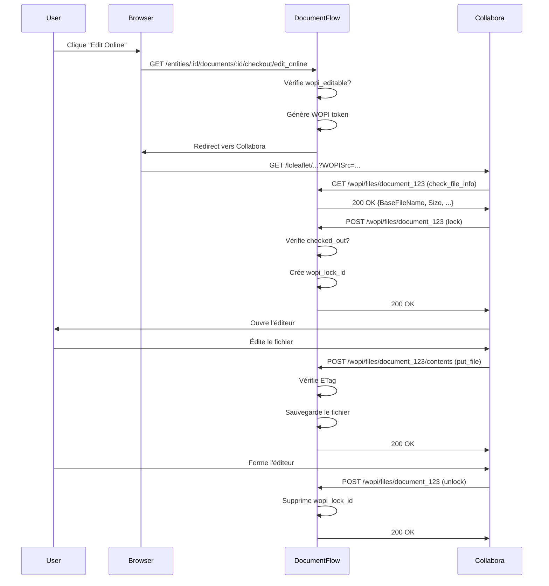

# Complexité 4: Intégration WOPI (Collabora Online)
**Date:** 31 juillet 2026  
**Version:** 1.0  
**Parent:** [COMPLEXITES_Et_DEFIS_2026-07-31.md](../COMPLEXITES_Et_DEFIS_2026-07-31.md)

---

## 📋 Table des Matières

1. [Problématique Générale](#-problématique-générale)
2. [Architecture WOPI](#-architecture-wopi)
3. [Modèles et Code Impliqués](#-modèles-et-code-impliqués)
4. [Scénarios Problématiques Détailés](#-scénarios-problématiques-détaillés)
5. [Solutions Proposées](#-solutions-proposées)
6. [Code d'Implémentation](#-code-dimplémentation)
7. [Tests Recommandés](#-tests-recommandés)
8. [Ressources et Références](#-ressources-et-références)

---

## 🎯 Problématique Générale

**WOPI** (Web Open Platform Interface) est un protocole développé par Microsoft pour permettre l'**édition en ligne de documents Office** via des services tiers comme **Collabora Online** (alternative open-source à Microsoft 365).

DocumentFlow utilise WOPI pour permettre aux utilisateurs d'**éditer des fichiers directement dans le navigateur** sans avoir à les télécharger.

### 🎯 Complexités Identifiées

| Défis | Description | Impact Potentiel | Priorité |
|-------|-------------|------------------|----------|
| **Conflit WOPI ↔ Check-out** | WOPI et DocumentFlow ont chacun leur système de lock | Écrasement des modifications | ⭐⭐⭐⭐ |
| **Authentification WOPI** | Collabora doit s'authentifier sans Devise | Fail de sécurité | ⭐⭐⭐⭐ |
| **Synchronisation des fichiers** | Collabora → Active Storage → DB | Perte de données | ⭐⭐⭐ |
| **Gestion des erreurs** | Collabora peut être indisponible | Downtime partiel | ⭐⭐ |
| **Formats de fichiers** | WOPI ne supporte pas tous les formats | Erreurs 404/415 | ⭐⭐ |
| **Timeout et latence** | WOPI est sensible aux timeouts | Perte de données | ⭐⭐ |

### 📊 Diagramme de Flux WOPI



---

## 🏗️ Architecture WOPI

### Composants Impliqués

```
┌─────────────────────────────────────────────────────────┐
│                        WOPI Flow                            │
├─────────────────────────────────────────────────────────┤
│                                                           │
│  Client (Browser)      DocumentFlow          Collabora   │
│        │                    │                   │         │
│        │ 1. GET /edit        │                   │         │
│        │───────────────────>│                   │         │
│        │                    │ 2. GET /wopi/files │         │
│        │                    │──────────────────>│         │
│        │                    │<──────────────────│         │
│        │ 3. Redirect        │                   │         │
│        │<───────────────────│                   │         │
│        │                    │                   │         │
│        │ 4. Ouvre éditeur   │                   │         │
│        │───────────────────>│──────────────────>│         │
│        │                    │                   │         │
│        │                    │ 5. POST /wopi/lock │         │
│        │                    │<──────────────────│         │
│        │                    │──────────────────>│         │
│        │                    │                   │         │
│        │ 6. Édite           │                   │         │
│        │────────────────────────────────────────────────>│         │
│        │                    │                   │         │
│        │                    │ 7. POST /wopi/contents │     │
│        │                    │<──────────────────│         │
│        │                    │──────────────────>│         │
│        │                    │                   │         │
│        │ 8. Ferme éditeur   │                   │         │
│        │───────────────────>│                   │         │
│        │                    │ 9. POST /wopi/unlock │       │
│        │                    │<──────────────────│         │
│                                                           │
└─────────────────────────────────────────────────────────┘
```

---

## 🏗️ Modèles et Code Impliqués

### Routes WOPI
```ruby
# config/routes.rb
namespace :wopi do
  get  "files/:id",          to: "files#check_file_info", as: :file
  get  "files/:id/contents", to: "files#get_file",         as: :file_contents
  post "files/:id/contents", to: "files#put_file"
  post "files/:id",          to: "files#lock_dispatch"
end
```

### Contrôleur WOPI
```ruby
# app/controllers/wopi/files_controller.rb
class Wopi::FilesController < ApplicationController
  skip_before_action :authenticate_user!
  skip_before_action :verify_authenticity_token

  def check_file_info
    @file = find_attachable_file
    render json: wopi_file_info(@file)
  end

  def get_file
    @file = find_attachable_file
    send_data @file.download, filename: @file.filename.to_s
  end

  def put_file
    @file = find_attachable_file
    @file.attach(
      io: StringIO.new(request.body.read),
      filename: @file.filename.to_s,
      content_type: @file.content_type
    )
    head :ok
  end

  def lock_dispatch
    @file = find_attachable_file
    record = @file.record # Document ou Annex
    
    case params[:X-WOPI-Lock]
    when "true"
      record.update!(wopi_lock_id: SecureRandom.uuid)
    when "false"
      record.update!(wopi_lock_id: nil)
    end
    
    head :ok
  end

  private

  def find_attachable_file
    if params[:id].start_with?("document_")
      Document.find(params[:id].gsub("document_", "")).main_file
    elsif params[:id].start_with?("annex_")
      Annex.find(params[:id].gsub("annex_", "")).file
    else
      raise ActiveRecord::RecordNotFound
    end
  end
end
```

### Modèle Document (WOPI)
```ruby
# app/models/document.rb
class Document < ApplicationRecord
  # Champ pour stocker l'ID de verrou WOPI
  string :wopi_lock_id
  
  # Méthode pour vérifier si le document peut être édité via WOPI
  def wopi_editable?
    return false if is_frozen? # Document gelé après signature
    return false if checked_out? # Déjà check-out
    return false if wopi_lock_id.present? # Déjà verrouillé par WOPI
    
    # Vérifier que le main_file existe et est un format supporté
    main_file.attached? && SUPPORTED_WOPI_CONTENT_TYPES.include?(main_file.content_type)
  end
  
  # ID WOPI pour ce document
  def wopi_file_id
    "document_#{id}"
  end
  
  # Formats supportés
  SUPPORTED_WOPI_CONTENT_TYPES = %w[
    application/vnd.openxmlformats-officedocument.wordprocessingml.document
    application/vnd.openxmlformats-officedocument.spreadsheetml.sheet
    application/vnd.openxmlformats-officedocument.presentationml.presentation
    application/msword
    application/vnd.ms-excel
    application/vnd.ms-powerpoint
  ].freeze
end
```

### Modèle Annex (WOPI)
```ruby
# app/models/annex.rb
class Annex < ApplicationRecord
  # ID WOPI pour cette annex
  def wopi_file_id
    "annex_#{id}"
  end
end
```

---

## ⚠️ Scénarios Problématiques Détailés

### 🎯 Cas 1: Conflit entre WOPI Lock et Check-out Applicatif

**Scénario :**
1. Alice **check-out** un document dans DocumentFlow (`checked_out_by_id = 123`)
2. Bob essaie d'ouvrir le **même document via WOPI** (Collabora)

**Problème :**
- **WOPI** ne connaît pas le **check-out applicatif**
- **Collabora** peut **autoriser l'édition** même si le document est check-out
- **Conflit** : Alice et Bob éditent le même document simultanément !

**Code Actuel (Problématique) :**
```ruby
# app/controllers/wopi/files_controller.rb
def lock_dispatch
  @file = find_attachable_file
  record = @file.record # Document ou Annex
  
  case params[:X-WOPI-Lock]
  when "true"
    # Pas de vérification du check-out !
    record.update!(wopi_lock_id: SecureRandom.uuid)
  when "false"
    record.update!(wopi_lock_id: nil)
  end
  
  head :ok
end
```

**Risques :**
- ❌ **Perte de données** : Écrasement des modifications
- ❌ **Expérience utilisateur mauvaise** : Incohérence entre l'UI et Collabora
- ❌ **Violation des règles métier** : Le check-out devrait bloquer toute édition

---

### 🎯 Cas 2: Authentification WOPI

**Scénario :**
Collabora appelle `/wopi/files/123` pour récupérer les infos d'un fichier.

**Problème :**
- **Pas d'authentification Devise** (car Collabora est un service externe)
- Comment **vérifier que Collabora a le droit** d'accéder au fichier ?
- Comment **associer l'utilisateur** (qui édite dans Collabora) au user DocumentFlow ?

**Code Actuel (Problématique) :**
```ruby
# app/controllers/wopi/files_controller.rb
class Wopi::FilesController < ApplicationController
  skip_before_action :authenticate_user! # ← Pas d'authentification !
  skip_before_action :verify_authenticity_token
  # ...
end
```

**Risques :**
- ❌ **Fail de sécurité** : Tout le monde peut accéder à `/wopi/files/123` s'il connaît l'ID
- ❌ **Fuite de données** : Documents sensibles accessibles sans auth
- ❌ **Non-conformité RGPD** : Accès non autorisé aux données personnelles

---

### 🎯 Cas 3: Synchronisation des Modifications

**Scénario :**
1. Un utilisateur édite un document dans Collabora pendant **10 minutes**
2. Pendant ce temps, un **autre utilisateur modifie le document dans DocumentFlow** (ex: change le nom)
3. Collabora **ne sait pas** que le document a été modifié

**Problème :**
- Quand l'utilisateur sauvegarde, **les modifications sont écrasées**
- **Conflit silencieux** : Pas d'avertissement

**Risques :**
- ❌ **Perte de travail** : L'utilisateur perd ses modifications
- ❌ **Données incohérentes** : Le fichier dans Collabora ≠ le fichier dans DocumentFlow
- ❌ **Frustration utilisateur** : Travail perdu sans explication

---

### 🎯 Cas 4: Gestion des Erreurs Collabora

**Scénario :**
Collabora est **indisponible** (maintenance, réseau down, erreur serveur).

**Problème :**
- Les utilisateurs **ne peuvent pas éditer** leurs documents
- Comment **notifier** les utilisateurs ?
- Comment **gérer les locks** qui peuvent rester bloqués ?

**Risques :**
- ❌ **Downtime** : Fonctionnalité critique bloquée
- ❌ **Locks orphelins** : Documents verrouillés indéfiniment
- ❌ **Mauvaise UX** : Les utilisateurs ne comprennent pas pourquoi WOPI ne fonctionne pas

---

### 🎯 Cas 5: Formats de Fichiers Non Supportés

**Scénario :**
Un utilisateur essaie d'ouvrir un **PDF** ou une **image** avec WOPI.

**Problème :**
- WOPI **ne supporte que** Word, Excel, PowerPoint (et quelques autres)
- Collabora **ne peut pas éditer** ces formats
- Comment **gérer ça proprement** ?

**Risques :**
- ❌ **Erreur 500** : Collabora retourne une erreur non gérée
- ❌ **Expérience utilisateur mauvaise** : L'utilisateur ne comprend pas pourquoi ça ne marche pas
- ❌ **Logs pollués** : Erreurs répétées dans les logs

---

### 🎯 Cas 6: Timeout et Latence

**Scénario :**
- Un utilisateur édite un **gros fichier** (100MB+)
- Collabora met **30 secondes** à sauvegarder
- DocumentFlow a un **timeout de 30 secondes** sur les requêtes

**Problème :**
- La requête `put_file` **timeout** avant que Collabora ait fini
- Le fichier **n'est pas sauvegardé** correctement
- L'utilisateur **perd ses modifications**

**Risques :**
- ❌ **Perte de données** : Modifications non sauvegardées
- ❌ **Frustration utilisateur** : Travail perdu
- ❌ **Instabilité** : Timeouts répétés

---

## 💡 Solutions Proposées

| Problème | Solution | Complexité | Impact |
|----------|----------|------------|--------|
| Conflit WOPI ↔ Check-out | Synchronisation des locks | ⭐⭐ | Haut |
| Authentification WOPI | Tokens JWT signés | ⭐⭐ | Haut |
| Synchronisation | Versioning + ETags | ⭐⭐ | Moyen |
| Erreurs Collabora | Circuit breaker + fallback | ⭐⭐ | Moyen |
| Formats non supportés | Détection + message clair | ⭐ | Moyen |
| Timeout/latence | Async processing + background jobs | ⭐⭐⭐ | Faible |

---

## 🔧 Code d'Implémentation

### ✅ Solution 1: Synchronisation WOPI ↔ Check-out

**Objectif :** Empêcher l'édition WOPI si le document est check-out, et vice versa.

**Fichier :** `app/controllers/wopi/files_controller.rb`
```ruby
class Wopi::FilesController < ApplicationController
  skip_before_action :authenticate_user!
  skip_before_action :verify_authenticity_token
  before_action :verify_wopi_token
  before_action :check_document_availability

  # ...

  def lock_dispatch
    @file = find_attachable_file
    record = @file.record # Document ou Annex
    
    case params[:X-WOPI-Lock]
    when "true"
      # Vérifier que le document n'est pas déjà check-out
      if record.respond_to?(:checked_out?) && record.checked_out?
        render json: { 
          error: "Document is checked out by another user",
          Code: "LockConflict"
        }, status: :conflict
        return
      end
      
      # Vérifier que le document n'est pas déjà verrouillé par WOPI
      if record.wopi_lock_id.present?
        render json: { 
          error: "Document is already locked by WOPI",
          Code: "WOPILockConflict"
        }, status: :conflict
        return
      end
      
      # Créer le lock WOPI
      record.update!(wopi_lock_id: SecureRandom.uuid)
      
    when "false"
      # Supprimer le lock WOPI
      record.update!(wopi_lock_id: nil)
    end
    
    head :ok
  end

  private

  def check_document_availability
    @file = find_attachable_file
    record = @file.record
    
    # Vérifier que le document existe et est accessible
    if record.is_a?(Document) && !DocumentPolicy.new(current_wopi_user, record).show?
      render json: { error: "Access denied" }, status: :forbidden
    end
  end

  def current_wopi_user
    @current_wopi_user ||= User.find_by(id: doorkeeper_token&.resource_owner_id) if doorkeeper_token
  end
end
```

**Fichier :** `app/models/document.rb`
```ruby
# Ajouter une méthode pour vérifier si le document peut être édité via WOPI
def wopi_editable?
  return false if is_frozen? # Document gelé après signature
  return false if checked_out? # Déjà check-out
  return false if wopi_lock_id.present? # Déjà verrouillé par WOPI
  
  # Vérifier que le main_file existe et est un format supporté
  main_file.attached? && SUPPORTED_WOPI_CONTENT_TYPES.include?(main_file.content_type)
end

# Constante pour les formats supportés
SUPPORTED_WOPI_CONTENT_TYPES = %w[
  application/vnd.openxmlformats-officedocument.wordprocessingml.document
  application/vnd.openxmlformats-officedocument.spreadsheetml.sheet
  application/vnd.openxmlformats-officedocument.presentationml.presentation
  application/msword
  application/vnd.ms-excel
  application/vnd.ms-powerpoint
  application/vnd.oasis.opendocument.text
  application/vnd.oasis.opendocument.spreadsheet
  application/vnd.oasis.opendocument.presentation
].freeze
```

**Fichier :** `app/controllers/documents_controller.rb` (ou DocumentCheckouts)
```ruby
# Dans l'action de check-out
def create
  @document = current_entity.documents.find(params[:document_id])
  authorize @document
  
  # Vérifier que le document n'est pas déjà verrouillé par WOPI
  if @document.wopi_lock_id.present?
    redirect_to entity_document_path(current_entity, @document),
      alert: "This document is currently being edited online and cannot be checked out."
    return
  end
  
  # ... (logique de check-out existante)
end
```

---

### ✅ Solution 2: Authentification WOPI avec JWT

**Objectif :** Sécuriser l'accès aux endpoints WOPI avec des tokens JWT.

**Configuration :**
```ruby
# config/initializers/wopi.rb
Rails.application.config.wopi = ActiveSupport::OrderedOptions.new
Rails.application.config.wopi.secret = ENV["WOPI_JWT_SECRET"] || SecureRandom.hex(64)
Rails.application.config.wopi.issuer = ENV["WOPI_JWT_ISSUER"] || "documentflow"
Rails.application.config.wopi.audience = ENV["WOPI_JWT_AUDIENCE"] || "https://collabora.example.com"
Rails.application.config.wopi.expiration = 1.hour
```

**Fichier :** `app/controllers/wopi/files_controller.rb`
```ruby
class Wopi::FilesController < ApplicationController
  skip_before_action :authenticate_user!
  skip_before_action :verify_authenticity_token
  before_action :verify_wopi_token

  private

  def verify_wopi_token
    token = request.headers["Authorization"]&.split("Bearer ")&.last
    unless token
      render json: { error: "Missing WOPI token" }, status: :unauthorized
      return
    end
    
    begin
      payload = JWT.decode(
        token,
        Rails.application.config.wopi.secret,
        true,
        algorithm: "HS256",
        iss: Rails.application.config.wopi.issuer,
        aud: Rails.application.config.wopi.audience,
        verify_iss: true,
        verify_aud: true,
        verify_expiration: true
      ).first
      
      @current_wopi_user = User.find_by(id: payload["sub"])
      @wopi_token_payload = payload
      
    rescue JWT::ExpiredSignature
      render json: { error: "WOPI token expired" }, status: :unauthorized
    rescue JWT::DecodeError => e
      Rails.logger.error "[WOPI] JWT Decode Error: #{e.message}"
      render json: { error: "Invalid WOPI token" }, status: :unauthorized
    end
  end

  def wopi_file_info(file)
    {
      BaseFileName: file.filename.to_s,
      Size: file.blob.byte_size,
      OwnerId: @current_wopi_user&.id || "anonymous",
      UserId: @current_wopi_user&.id || "anonymous",
      PostMessageOrigin: Rails.application.config.wopi.audience,
      SupportsFolders: false,
      SupportsUpdate: true,
      SupportsLocks: true,
      SupportsGetLock: true,
      SupportsExtendedLockLength: true,
      EnableOwnerTermination: true,
      FileSharingUrl: wopi_file_sharing_url(file.record),
      HostEditUrl: "#{Rails.application.config.wopi.audience}/loleaflet/#{file.record.wopi_file_id}",
      HostViewUrl: "#{Rails.application.config.wopi.audience}/loleaflet/#{file.record.wopi_file_id}?WOPISrc=#{wopi_file_url(file.record)}&readOnly=true"
    }
  end
end
```

**Fichier :** `app/models/document.rb`
```ruby
# Ajouter des méthodes pour WOPI
def wopi_file_id
  "document_#{id}"
end

# Pour Annex
class Annex < ApplicationRecord
  def wopi_file_id
    "annex_#{id}"
  end
end
```

**Génération du token WOPI :**
```ruby
# Dans le contrôleur qui redirige vers WOPI (ex: DocumentCheckouts#edit_online)
def edit_online
  @document = current_entity.documents.find(params[:document_id])
  authorize @document
  
  # Générer un token WOPI pour l'utilisateur
  wopi_token = generate_wopi_token(@document, current_user)
  
  # Stocker le token dans la session ou un cache
  session[:wopi_token] = wopi_token
  
  # Rediriger vers Collabora avec le token
  wopi_url = "#{Rails.application.config.wopi.audience}/loleaflet/#{@document.wopi_file_id}?WOPISrc=#{wopi_file_url(@document)}&access_token=#{wopi_token}"
  redirect_to wopi_url, allow_other_host: true
end

private

def generate_wopi_token(document, user)
  payload = {
    sub: user.id, # Subject (user ID)
    name: user.full_name,
    email: user.email,
    iat: Time.now.to_i, # Issued at
    exp: Rails.application.config.wopi.expiration.from_now.to_i, # Expiration
    iss: Rails.application.config.wopi.issuer,
    aud: Rails.application.config.wopi.audience
  }
  
  JWT.encode(payload, Rails.application.config.wopi.secret, "HS256")
end
```

---

### ✅ Solution 3: Synchronisation avec ETags

**Objectif :** Détecter les modifications concurrentes entre Collabora et DocumentFlow.

**Fichier :** `app/controllers/wopi/files_controller.rb`
```ruby
class Wopi::FilesController < ApplicationController
  # ...

  def get_file
    @file = find_attachable_file
    
    # Vérifier l'ETag pour détecter les modifications concurrentes
    if request.headers["If-None-Match"]
      current_etag = @file.blob.checksum
      if request.headers["If-None-Match"] == current_etag
        head :not_modified
        return
      end
    end
    
    # Envoyer le fichier avec l'ETag
    response.headers["ETag"] = @file.blob.checksum
    response.headers["Last-Modified"] = @file.blob.created_at.httpdate
    
    send_data @file.download, 
      filename: @file.filename.to_s,
      type: @file.content_type,
      disposition: "inline"
  end

  def put_file
    @file = find_attachable_file
    record = @file.record
    
    # Vérifier l'ETag pour éviter les écrasements
    if request.headers["If-Match"]
      current_etag = @file.blob.checksum
      unless request.headers["If-Match"] == current_etag
        render json: { 
          error: "ETag mismatch - file was modified by another user",
          Code: "Conflict"
        }, status: :conflict
        return
      end
    end
    
    # Sauvegarder le fichier
    @file.attach(
      io: StringIO.new(request.body.read),
      filename: @file.filename.to_s,
      content_type: @file.content_type
    )
    
    # Mettre à jour l'ETag (checksum)
    head :ok
  end

  def check_file_info
    @file = find_attachable_file
    
    response.headers["ETag"] = @file.blob.checksum
    response.headers["Last-Modified"] = @file.blob.created_at.httpdate
    
    render json: wopi_file_info(@file)
  end
end
```

---

### ✅ Solution 4: Gestion des Erreurs Collabora

**Objectif :** Détecter si Collabora est disponible et gérer les erreurs gracieusement.

**Fichier :** `app/services/wopi/collabora_health_check.rb`
```ruby
# app/services/wopi/collabora_health_check.rb
class Wopi::CollaboraHealthCheck
  include Singleton
  
  CACHE_KEY = "wopi:collabora:health_check".freeze
  CACHE_TTL = 60.seconds
  
  def healthy?
    Rails.cache.fetch(CACHE_KEY, expires_in: CACHE_TTL) do
      check_collabora_health
    end
  end

  def force_check!
    Rails.cache.delete(CACHE_KEY)
    check_collabora_health
  end

  private

  def check_collabora_health
    uri = URI.parse(ENV["COLLABORA_HEALTH_URL"] || "https://collabora.example.com/health")
    
    Net::HTTP.start(uri.host, uri.port, use_ssl: uri.scheme == "https") do |http|
      request = Net::HTTP::Get.new(uri)
      response = http.request(request)
      response.code == "200"
    end
  rescue => e
    Rails.logger.error "[WOPI Health Check] Error: #{e.message}"
    false
  end
end
```

**Fichier :** `app/controllers/wopi/files_controller.rb`
```ruby
class Wopi::FilesController < ApplicationController
  before_action :check_collabora_availability

  private

  def check_collabora_availability
    unless Wopi::CollaboraHealthCheck.instance.healthy?
      render json: { 
        error: "Collabora Online is currently unavailable. Please try again later.",
        Code: "ServiceUnavailable"
      }, status: :service_unavailable
    end
  end
end
```

**Fichier :** `app/controllers/documents_controller.rb`
```ruby
# Dans le contrôleur Documents, vérifier la disponibilité de WOPI avant de rediriger
def edit_online
  @document = current_entity.documents.find(params[:id])
  authorize @document
  
  unless Wopi::CollaboraHealthCheck.instance.healthy?
    redirect_to entity_document_path(current_entity, @document),
      alert: "Collabora Online is currently unavailable. Please try again later."
    return
  end
  
  unless @document.wopi_editable?
    redirect_to entity_document_path(current_entity, @document),
      alert: "This document cannot be edited online. Only Office files are supported."
    return
  end
  
  # Rediriger vers l'URL WOPI
  redirect_to wopi_file_url(@document), allow_other_host: true
end
```

---

### ✅ Solution 5: Détection des Formats Supportés

**Objectif :** Filtrer les fichiers qui ne peuvent pas être édités avec WOPI.

**Fichier :** `app/controllers/wopi/files_controller.rb`
```ruby
class Wopi::FilesController < ApplicationController
  SUPPORTED_CONTENT_TYPES = %w[
    # Microsoft Office Open XML
    application/vnd.openxmlformats-officedocument.wordprocessingml.document
    application/vnd.openxmlformats-officedocument.spreadsheetml.sheet
    application/vnd.openxmlformats-officedocument.presentationml.presentation
    # Legacy Microsoft Office
    application/msword
    application/vnd.ms-excel
    application/vnd.ms-powerpoint
    # OpenDocument
    application/vnd.oasis.opendocument.text
    application/vnd.oasis.opendocument.spreadsheet
    application/vnd.oasis.opendocument.presentation
    # Other supported
    text/plain
    text/csv
  ].freeze

  def check_file_info
    @file = find_attachable_file
    
    unless SUPPORTED_CONTENT_TYPES.include?(@file.content_type)
      render json: { 
        error: "File format not supported by WOPI",
        Code: "UnsupportedMediaType",
        SupportedFormats: SUPPORTED_CONTENT_TYPES.join(", ")
      }, status: :unsupported_media_type
      return
    end
    
    render json: wopi_file_info(@file)
  end
end
```

**Fichier :** `app/models/document.rb`
```ruby
# Mettre à jour SUPPORTED_WOPI_CONTENT_TYPES
def wopi_editable?
  return false if is_frozen?
  return false if checked_out?
  return false if wopi_lock_id.present?
  
  main_file.attached? && self.class::SUPPORTED_WOPI_CONTENT_TYPES.include?(main_file.content_type)
end
```

---

### ✅ Solution 6: Gestion des Timeouts (Background Job)

**Objectif :** Éviter les timeouts en traitant les sauvegardes WOPI de manière asynchrone.

**Migration :**
```ruby
# db/migrate/[timestamp]_create_wopi_sessions.rb
class CreateWopiSessions < ActiveRecord::Migration[8.1]
  def change
    create_table :wopi_sessions do |t|
      t.string :wopi_file_id, null: false
      t.bigint :user_id
      t.bigint :file_id
      t.string :file_type # "Document" ou "Annex"
      t.string :lock_id, null: false
      t.datetime :locked_at
      t.datetime :last_heartbeat_at
      t.boolean :active, default: true
      t.timestamps
    end
    
    add_index :wopi_sessions, :wopi_file_id, unique: true
    add_index :wopi_sessions, :user_id
    add_index :wopi_sessions, :lock_id
  end
end
```

**Modèle :**
```ruby
# app/models/wopi_session.rb
class WopiSession < ApplicationRecord
  belongs_to :user, optional: true
  belongs_to :file, polymorphic: true
  
  before_create :generate_lock_id
  
  scope :active, -> { where(active: true) }
  scope :locked, -> { where.not(lock_id: nil) }
  scope :stale, -> { where("last_heartbeat_at < ?", 5.minutes.ago) }

  def generate_lock_id
    self.lock_id ||= SecureRandom.uuid
  end

  def heartbeat!
    update!(last_heartbeat_at: Time.current)
  end

  def expire!
    update!(active: false, lock_id: nil, locked_at: nil)
  end
end
```

**Job :**
```ruby
# app/jobs/wopi_save_file_job.rb
class WopiSaveFileJob < ApplicationJob
  queue_as :wopi
  
  def perform(file_id, file_type, file_data, user_id = nil)
    file = file_type.constantize.find(file_id)
    
    # Attacher le fichier
    file.attach(
      io: StringIO.new(file_data),
      filename: file.filename.to_s,
      content_type: file.content_type
    )
    
    # Mettre à jour la session WOPI
    session = WopiSession.find_by(file: file)
    session&.heartbeat!
    
    # Notifier l'utilisateur si nécessaire
    if user_id
      user = User.find_by(id: user_id)
      Turbo::StreamsChannel.broadcast_replace_to(
        user,
        :document_file,
        partial: "documents/file",
        locals: { document: file.record }
      ) if file.record.is_a?(Document)
    end
  end
end
```

**Fichier :** `app/controllers/wopi/files_controller.rb`
```ruby
class Wopi::FilesController < ApplicationController
  # ...

  def put_file
    @file = find_attachable_file
    record = @file.record
    
    # Vérifier l'ETag
    if request.headers["If-Match"]
      current_etag = @file.blob.checksum
      unless request.headers["If-Match"] == current_etag
        render json: { error: "ETag mismatch" }, status: :conflict
        return
      end
    end
    
    # Traitement asynchrone pour éviter les timeouts
    WopiSaveFileJob.perform_later(
      @file.id,
      @file.record.class.name,
      request.body.read,
      @current_wopi_user&.id
    )
    
    head :accepted # 202 Accepted (traitement asynchrone)
  end
end
```

---

## 🧪 Tests Recommandés

### Tests Unitaires (RSpec)

#### Test du Contrôleur WOPI
```ruby
# spec/controllers/wopi/files_controller_spec.rb
RSpec.describe Wopi::FilesController, type: :controller do
  let(:entity) { create(:entity) }
  let(:user) { create(:user) }
  let(:document) { create(:document, entity: entity) }
  
  before do
    create(:entity_user, entity: entity, user: user, role: "member")
    allow(Rails.application.config.wopi).to receive(:secret).and_return("test_secret")
    allow(Rails.application.config.wopi).to receive(:issuer).and_return("test_issuer")
    allow(Rails.application.config.wopi).to receive(:audience).and_return("test_audience")
  end

  describe "GET #check_file_info" do
    it "returns file info for valid document" do
      document.main_file.attach(
        io: StringIO.new("test"),
        filename: "test.docx",
        content_type: "application/vnd.openxmlformats-officedocument.wordprocessingml.document"
      )
      
      get :check_file_info, params: { id: "document_#{document.id}" }
      
      expect(response).to have_http_status(:ok)
      json = JSON.parse(response.body)
      expect(json["BaseFileName"]).to eq("test.docx")
    end

    it "returns 415 for unsupported format" do
      document.main_file.attach(
        io: StringIO.new("test"),
        filename: "test.pdf",
        content_type: "application/pdf"
      )
      
      get :check_file_info, params: { id: "document_#{document.id}" }
      
      expect(response).to have_http_status(:unsupported_media_type)
    end
  end

  describe "POST #lock_dispatch" do
    context "when document is checked out" do
      it "returns conflict when trying to lock" do
        document.update!(checked_out_by: user)
        document.main_file.attach(
          io: StringIO.new("test"),
          filename: "test.docx",
          content_type: "application/vnd.openxmlformats-officedocument.wordprocessingml.document"
        )
        
        post :lock_dispatch, 
          params: { id: "document_#{document.id}" },
          headers: { "X-WOPI-Lock" => "true" }
        
        expect(response).to have_http_status(:conflict)
        expect(JSON.parse(response.body)["error"]).to include("checked out")
      end
    end

    context "when document is already WOPI locked" do
      it "returns conflict when trying to lock again" do
        document.update!(wopi_lock_id: "existing_lock")
        document.main_file.attach(
          io: StringIO.new("test"),
          filename: "test.docx",
          content_type: "application/vnd.openxmlformats-officedocument.wordprocessingml.document"
        )
        
        post :lock_dispatch, 
          params: { id: "document_#{document.id}" },
          headers: { "X-WOPI-Lock" => "true" }
        
        expect(response).to have_http_status(:conflict)
        expect(JSON.parse(response.body)["error"]).to include("already locked")
      end
    end

    context "with valid lock request" do
      it "creates a new lock" do
        document.main_file.attach(
          io: StringIO.new("test"),
          filename: "test.docx",
          content_type: "application/vnd.openxmlformats-officedocument.wordprocessingml.document"
        )
        
        expect {
          post :lock_dispatch, 
            params: { id: "document_#{document.id}" },
            headers: { "X-WOPI-Lock" => "true" }
        }.to change { document.reload.wopi_lock_id }.from(nil).to(be_present)
        
        expect(response).to have_http_status(:ok)
      end
    end
  end
end
```

#### Test du Health Check
```ruby
# spec/services/wopi/collabora_health_check_spec.rb
RSpec.describe Wopi::CollaboraHealthCheck do
  describe ".healthy?" do
    context "when Collabora is available" do
      before do
        stub_request(:get, "https://collabora.example.com/health")
          .to_return(status: 200)
      end
      
      it "returns true" do
        expect(described_class.instance.healthy?).to be true
      end
    end

    context "when Collabora is unavailable" do
      before do
        stub_request(:get, "https://collabora.example.com/health")
          .to_timeout
      end
      
      it "returns false" do
        expect(described_class.instance.healthy?).to be false
      end
    end

    context "with caching" do
      it "caches the result" do
        stub_request(:get, "https://collabora.example.com/health")
          .to_return(status: 200)
        
        expect(described_class.instance.healthy?).to be true
        
        # Deuxième appel utilise le cache
        stub_request(:get, "https://collabora.example.com/health")
        expect(described_class.instance.healthy?).to be true
      end
    end
  end
end
```

#### Test du Modèle Document (WOPI)
```ruby
# spec/models/document_spec.rb
RSpec.describe Document do
  let(:entity) { create(:entity) }
  let(:department) { create(:department, entity: entity) }

  describe "#wopi_editable?" do
    let(:document) { create(:document, entity: entity, department: department) }

    before do
      document.main_file.attach(
        io: StringIO.new("test"),
        filename: "test.docx",
        content_type: "application/vnd.openxmlformats-officedocument.wordprocessingml.document"
      )
    end

    it "returns true for normal document" do
      expect(document.wopi_editable?).to be true
    end

    it "returns false when document is frozen" do
      document.update!(is_frozen: true)
      expect(document.wopi_editable?).to be false
    end

    it "returns false when document is checked out" do
      document.update!(checked_out_by: create(:user))
      expect(document.wopi_editable?).to be false
    end

    it "returns false when document is WOPI locked" do
      document.update!(wopi_lock_id: "some_lock")
      expect(document.wopi_editable?).to be false
    end

    it "returns false for unsupported file type" do
      document.main_file.attach(
        io: StringIO.new("test"),
        filename: "test.pdf",
        content_type: "application/pdf"
      )
      expect(document.wopi_editable?).to be false
    end

    it "returns false when main_file is not attached" do
      document.main_file.purge
      expect(document.wopi_editable?).to be false
    end
  end

  describe "#wopi_file_id" do
    it "returns correct format" do
      document = create(:document, id: 123)
      expect(document.wopi_file_id).to eq("document_123")
    end
  end
end
```

### Tests d'Intégration

```ruby
# spec/requests/wopi_spec.rb
RSpec.describe "WOPI Integration", type: :request do
  let(:entity) { create(:entity) }
  let(:user) { create(:user) }
  let(:document) { create(:document, entity: entity) }
  
  before do
    create(:entity_user, entity: entity, user: user, role: "member")
    sign_in user
    document.main_file.attach(
      io: StringIO.new("test content"),
      filename: "test.docx",
      content_type: "application/vnd.openxmlformats-officedocument.wordprocessingml.document"
    )
  end

  describe "WOPI file access" do
    it "denies access to checked out documents" do
      document.update!(checked_out_by: user)
      
      get "/wopi/files/document_#{document.id}"
      
      expect(response).to have_http_status(:conflict)
      expect(JSON.parse(response.body)["error"]).to include("checked out")
    end

    it "allows access to available documents" do
      get "/wopi/files/document_#{document.id}"
      
      expect(response).to have_http_status(:ok)
      json = JSON.parse(response.body)
      expect(json["BaseFileName"]).to eq("test.docx")
    end
  end

  describe "document online editing" do
    it "redirects to WOPI when available" do
      allow(Wopi::CollaboraHealthCheck.instance).to receive(:healthy?).and_return(true)
      
      get edit_online_entity_document_path(entity, document)
      
      expect(response).to redirect_to("https://collabora.example.com/loleaflet/document_#{document.id}?WOPISrc=#{wopi_file_url(document)}&readOnly=false")
    end

    it "shows error when WOPI is unavailable" do
      allow(Wopi::CollaboraHealthCheck.instance).to receive(:healthy?).and_return(false)
      
      get edit_online_entity_document_path(entity, document)
      
      expect(response).to redirect_to(entity_document_path(entity, document))
      expect(flash[:alert]).to include("Collabora Online is currently unavailable")
    end

    it "shows error for unsupported file types" do
      document.main_file.attach(
        io: StringIO.new("test"),
        filename: "test.pdf",
        content_type: "application/pdf"
      )
      
      get edit_online_entity_document_path(entity, document)
      
      expect(response).to redirect_to(entity_document_path(entity, document))
      expect(flash[:alert]).to include("cannot be edited online")
    end
  end
end
```

---

## 🎯 Résumé des Actions Clés

| Action | Fichier | Description | Priorité |
|--------|---------|-------------|----------|
| Vérification check-out | `app/controllers/wopi/files_controller.rb` | Empêche l'édition si check-out | 🔴 |
| Authentification JWT | `app/controllers/wopi/files_controller.rb` | Sécurise l'accès WOPI | 🔴 |
| Synchronisation ETags | `app/controllers/wopi/files_controller.rb` | Détecte les conflits | 🟡 |
| Health Check | `app/services/wopi/collabora_health_check.rb` | Vérifie la disponibilité | 🟡 |
| Détection formats | `app/controllers/wopi/files_controller.rb` | Filtre les formats non supportés | 🟡 |
| Background Jobs | `app/jobs/wopi_save_file_job.rb` | Évite les timeouts | 🟢 |

---

## 📚 Ressources et Références

### Documentation Officielle
- [WOPI Protocol Documentation](https://docs.microsoft.com/en-us/office/office-365-platform-concepts-and-scenarios/wopi/wopi-rest)
- [Collabora Online](https://www.collaboraoffice.com/)
- [WOPI GitHub](https://github.com/Microsoft-Office-Dev/Office-IT-Pro-Deployment-Scripts/tree/master/Office/WOPI)

### WOPI Endpoints
- **check_file_info:** Retourne les métadonnées du fichier
- **get_file:** Télécharge le fichier pour édition
- **put_file:** Reçoit les modifications de Collabora
- **lock:** Verrouille/déverrouille le fichier

### Bonnes Pratiques
- Toujours **vérifier les permissions** avant de retourner des données WOPI
- Utiliser des **tokens JWT** pour l'authentification
- Implémenter les **ETags** pour détecter les conflits
- **Monitorer** la disponibilité de Collabora
- Tester avec **différents formats de fichiers**
- Prévoir des **fallbacks** en cas d'erreur

---

## 🔗 Voir Aussi

- [Complexité 1: Workflows](../01_workflows.md)
- [Complexité 2: Données Polymorphiques](../02_polymorphic_associations.md)
- [Complexité 3: Numérotation des Documents](../03_document_numbering.md)
- [Complexité 5: Notifications Temps Réel](../05_real_time_notifications.md)

---

**Prochaine étape :** [Complexité 5: Notifications Temps Réel](../05_real_time_notifications.md) 🚀
