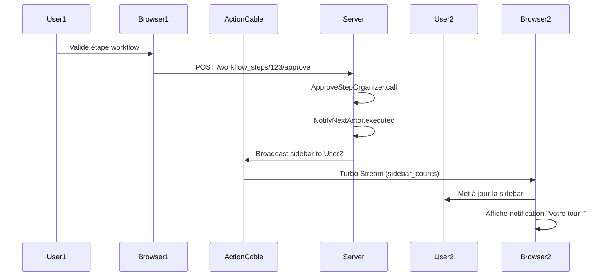

# Complexité 5: Notifications en Temps Réel
**Date:** 31 juillet 2026  
**Version:** 1.0  
**Parent:** [COMPLEXITES_Et_DEFIS_2026-07-31.md](../COMPLEXITES_Et_DEFIS_2026-07-31.md)

---

## 📋 Table des Matières

1. [Problématique Générale](#-problématique-générale)
2. [Architecture des Notifications](#-architecture-des-notifications)
3. [Modèles et Code Impliqués](#-modèles-et-code-impliqués)
4. [Scénarios Problématiques Détailés](#-scénarios-problématiques-détaillés)
5. [Solutions Proposées](#-solutions-proposées)
6. [Code d'Implémentation](#-code-dimplémentation)
7. [Tests Recommandés](#-tests-recommandés)
8. [Ressources et Références](#-ressources-et-références)

---

## 🎯 Problématique Générale

DocumentFlow utilise **Turbo Streams** (via Action Cable) pour des **mises à jour en temps réel** dans l'interface utilisateur. Cela permet :

- ✅ Des **notifications instantanées** (nouveau document, validation requise)
- ✅ Des **mises à jour partielles** (sidebar counts, badges)
- ✅ Une **expérience utilisateur fluide** sans rafraîchissement de page

Cependant, cette approche introduit des **complexités significatives** :

### 🎯 Complexités Identifiées

| Défis | Description | Impact Potentiel | Priorité |
|-------|-------------|------------------|----------|
| **Client déconnecté** | Notifications perdues si le client est offline | UX dégradée (notifications manquées) | ⭐⭐⭐ |
| **Duplication** | Plusieurs services déclenchent le même broadcast | Flickering UI, requêtes inutiles | ⭐⭐ |
| **Ordre des notifications** | Notifications arrivent dans le mauvais ordre | Confusion utilisateur | ⭐⭐ |
| **N+1 dans les Streams** | Chaque broadcast déclenche une requête SQL | Charge serveur élevée | ⭐⭐⭐ |
| **Broadcasts en cascade** | Validation en chaîne → storm de notifications | Performance dégradée | ⭐⭐ |
| **Scalabilité** | Action Cable ne scale pas bien avec beaucoup d'utilisateurs | Ressources serveur épuisées | ⭐⭐ |

### 📊 Diagramme de Flux des Notifications



---

## 🏗️ Architecture des Notifications

### Composants Impliqués

```
┌─────────────────────────────────────────────────────────────┐
│                    NOTIFICATION SYSTEM                         │
├─────────────────────────────────────────────────────────────┤
│                                                                 │
│  Frontend (Browser)      Action Cable      Backend (Rails)     │
│  ────────────────────    ──────────────    ─────────────────  │
│        │                        │                   │          │
│        │ 1. Connect            │                   │          │
│        │───────────────────────>│                   │          │
│        │                        │                   │          │
│        │ 2. Subscribe           │                   │          │
│        │───────────────────────>│────────────────>│          │
│        │                        │                   │          │
│        │ 3. Event (approval)    │                   │          │
│        │                        │<──────────────────│          │
│        │                        │                   │          │
│        │ 4. Broadcast           │                   │          │
│        │<───────────────────────│<──────────────────│          │
│        │                        │                   │          │
│        │ 5. Render Partial      │                   │          │
│        │    (sidebar)           │                   │          │
│        │───────────────────────>│                   │          │
│                                                                 │
└─────────────────────────────────────────────────────────────┘
```

### Modèles et Code Impliqués

#### Action Cable Channel
```ruby
# app/channels/turbo_streams_channel.rb
class TurboStreamsChannel < ApplicationCable::Channel
  def subscribed
    stream_from "turbo_streams:#{current_user.id}"
  end

  def unsubscribed
    stop_all_streams
  end
end
```

#### Configuration Cable
```ruby
# config/cable.yml
development:
  adapter: redis
  url: redis://localhost:6379/1

test:
  adapter: test

production:
  adapter: redis
  url: <%= ENV.fetch("REDIS_URL") { "redis://localhost:6379/1" } %>
  channel_prefix: documentflow_production
```

#### Service de Notification
```ruby
# app/services/workflow/actions/notify_next_actor.rb
module Workflow
  module Actions
    class NotifyNextActor < ApplicationAction
      expects :document, :next_actor

      executed do |ctx|
        # ... logique de notification
        
        # Broadcast en temps réel
        broadcast_sidebar_to(ctx.next_actor)
        
        ctx
      end

      def self.broadcast_sidebar_to(user)
        Turbo::StreamsChannel.broadcast_replace_later_to(
          user,
          :sidebar_counts,
          partial: "shared/sidebar_counts",
          locals: { user: user }
        )
      end
    end
  end
end
```

#### Composant Sidebar
```erb
<!-- app/components/shared/sidebar_counts_component.html.erb -->
<div id="sidebar_counts">
  <%= render "shared/sidebar_counts", user: current_user %>
</div>
```

```ruby
# app/components/shared/sidebar_counts_component.rb
class Shared::SidebarCountsComponent < ViewComponent::Base
  def initialize(user:)
    @user = user
  end
end
```

#### Partial Sidebar Counts
```erb
<!-- app/views/shared/_sidebar_counts.html.erb -->
<span class="badge bg-primary">
  <%= @user.documents.pending_for(@user).count %>
</span>
<span class="badge bg-warning">
  <%= @user.documents.todo_for(@user).count %>
</span>
<span class="badge bg-info">
  <%= @user.documents.waiting_for(@user).count %>
</span>
```

---

## ⚠️ Scénarios Problématiques Détailés

### 🎯 Cas 1: Client Déconnecté

**Scénario :**
1. Un utilisateur est **déconnecté** (ferme son navigateur ou perd sa connexion)
2. Un document lui est **assigné pour validation**
3. Il se reconnecte **1 heure plus tard**

**Problème :**
- La notification **a été envoyée pendant qu'il était offline**
- Il ne la **reçoit pas** à la reconnexion
- Comment **synchroniser l'état** ?

**Code Actuel (Problématique) :**
```ruby
# Turbo Streams n'a PAS de persistance
# Si le client est déconnecté, le message est PERDU
Turbo::StreamsChannel.broadcast_replace_later_to(user, ...)
```

**Risques :**
- ❌ **Notifications perdues** : L'utilisateur ne sait pas qu'il a des documents à valider
- ❌ **Expérience utilisateur mauvaise** : Il faut rafraîchir manuellement
- ❌ **Inconsistance** : La sidebar n'est pas à jour

---

### 🎯 Cas 2: Duplication de Notifications

**Scénario :**
- Un document est validé → **NotifyNextActor** est appelé
- **Deux services différents** appellent `broadcast_sidebar_to` pour le même utilisateur
- L'utilisateur reçoit **deux mises à jour identiques**

**Problème :**
- **Flickering** : La sidebar clignote
- **Requêtes inutiles** : Le serveur rend le même partial deux fois

**Code Actuel (Problématique) :**
```ruby
# Dans plusieurs services :
broadcast_sidebar_to(user) # Peut être appelé plusieurs fois
```

**Risques :**
- ⚠️ **Performance dégradée** : Rendu inutile de templates
- ⚠️ **Bugs visuels** : UI qui clignote
- ⚠️ **Logs pollués** : Difficile de debuguer

---

### 🎯 Cas 3: Ordre des Notifications

**Scénario :**
1. Document A est assigné à Alice
2. Document B est assigné à Alice
3. Alice valide Document A
4. Document C est assigné à Alice

**Problème :**
- Les notifications peuvent arriver dans **le mauvais ordre** (C avant B)
- L'utilisateur voit **Document C** avant **Document B**

**Risques :**
- ⚠️ **Confusion** : L'utilisateur ne comprend pas la séquence des événements
- ⚠️ **Priorisation incorrecte** : Les documents ne sont pas dans le bon ordre

---

### 🎯 Cas 4: Requêtes N+1 dans les Streams

**Scénario :**
Le partial `_sidebar_counts` fait :
```erb
<% current_user.documents.pending_for(current_user).count %>
```

**Problème :**
- Chaque broadcast **re-rend le partial**
- Chaque rendu **fait une requête SQL**
- Si 100 utilisateurs reçoivent une notification → **100 requêtes SQL**

**Risques :**
- ❌ **Charge serveur élevée** : Base de données saturée
- ❌ **Lenteur** : Les notifications mettent du temps à arriver
- ❌ **Timeout** : En production avec beaucoup d'utilisateurs

---

### 🎯 Cas 5: Broadcasts en Cascade

**Scénario :**
- Alice valide une étape → **NotifyNextActor** (Bob)
- Bob valide → **NotifyNextActor** (Charlie)
- Charlie valide → **NotifyNextActor** (Dave)
- ... (10 validations en chaîne)

**Problème :**
- Chaque validation **déclenche un broadcast**
- Si 10 personnes valident en chaîne → **10 broadcasts**
- **Problème de performance** si beaucoup d'utilisateurs

**Risques :**
- ⚠️ **Storm de notifications** : Le serveur passe son temps à broadcaster
- ⚠️ **Latence** : Les notifications mettent du temps à arriver
- ⚠️ **Instabilité** : Risque de crash du serveur

---

### 🎯 Cas 6: Scalabilité Action Cable

**Scénario :**
- DocumentFlow a **10 000 utilisateurs connectés** simultanément
- Chaque utilisateur a **plusieurs connexions WebSocket** ouvertes

**Problème :**
- **Action Cable** utilise **beaucoup de mémoire** pour gérer les connexions
- **Redis** (utilisé comme pub/sub) peut devenir un **goulot d'étranglement**
- **Timeouts** peuvent survenir avec beaucoup de connexions

**Risques :**
- ⚠️ **Downtime** : Le serveur ne peut plus gérer la charge
- ⚠️ **Latence élevée** : Les notifications arrivent avec du retard
- ⚠️ **Coût élevé** : Besoin de plus de ressources serveur

---

## 💡 Solutions Proposées

| Problème | Solution | Complexité | Impact |
|----------|----------|------------|--------|
| Client déconnecté | Notifications persistantes + polling | ⭐⭐ | Moyen |
| Duplication | Deduplication (Redis cache) | ⭐ | Moyen |
| Ordre | Timestamp + queue (Solid Queue) | ⭐⭐ | Moyen |
| N+1 dans Streams | Cache des counts (Redis) | ⭐ | Haut |
| Broadcasts en cascade | Throttling (1 broadcast/second/user) | ⭐ | Moyen |
| Scalabilité | Service externe (Pusher, Ably) | ⭐⭐⭐ | Faible |

---

## 🔧 Code d'Implémentation

### ✅ Solution 1: Notifications Persistantes

**Idée :** Stocker les notifications dans la base de données pour les utilisateurs déconnectés.

#### Migration
```ruby
# db/migrate/[timestamp]_create_notifications.rb
class CreateNotifications < ActiveRecord::Migration[8.1]
  def change
    create_table :notifications do |t|
      t.references :user, null: false, foreign_key: true
      t.references :notifiable, polymorphic: true
      t.string :action, null: false # "workflow_assigned", "document_received", etc.
      t.jsonb :data, default: {}
      t.boolean :read, default: false
      t.datetime :read_at
      t.timestamps
    end
    
    add_index :notifications, [:user_id, :read] # Pour les queries de type "unread count"
    add_index :notifications, [:user_id, :created_at] # Pour le polling
    add_index :notifications, [:notifiable_type, :notifiable_id]
  end
end
```

#### Modèle
```ruby
# app/models/notification.rb
class Notification < ApplicationRecord
  belongs_to :user
  belongs_to :notifiable, polymorphic: true
  
  scope :unread, -> { where(read: false) }
  scope :recent, -> { order(created_at: :desc).limit(50) }
  scope :for_user, ->(user) { where(user: user) }
  
  # Méthode pour marquer comme lu
  def mark_as_read!
    update!(read: true, read_at: Time.current)
  end
  
  # Méthode pour obtenir le message à afficher
  def message
    case action
    when "workflow_assigned"
      "A document is waiting for your validation"
    when "document_received"
      "You have received a new document"
    when "document_sent"
      "Your document has been sent"
    else
      "New notification"
    end
  end
end
```

#### Service Modifié
```ruby
# app/services/workflow/actions/notify_next_actor.rb
module Workflow
  module Actions
    class NotifyNextActor < ApplicationAction
      expects :document, :next_actor

      executed do |ctx|
        # Créer une notification persistante
        Notification.create!(
          user: ctx.next_actor,
          notifiable: ctx.document,
          action: "workflow_assigned",
          data: { 
            step_id: ctx.next_step&.id,
            step_role: ctx.next_step&.role
          }
        )
        
        # Broadcast en temps réel SI le user est connecté
        if user_online?(ctx.next_actor)
          broadcast_sidebar_to(ctx.next_actor)
        end
        
        ctx
      end

      def self.user_online?(user)
        # Vérifier si l'utilisateur a une connexion WebSocket active
        ActionCable.server.pubsub.redis.connection.exists("turbo_streams:#{user.id}")
      rescue
        false
      end

      def self.broadcast_sidebar_to(user)
        Turbo::StreamsChannel.broadcast_replace_later_to(
          user,
          :sidebar_counts,
          partial: "shared/sidebar_counts",
          locals: { user: user }
        )
      end
    end
  end
end
```

#### Contrôleur
```ruby
# app/controllers/notifications_controller.rb
class NotificationsController < ApplicationController
  before_action :authenticate_user!

  def index
    @notifications = current_user.notifications.recent.includes(:notifiable)
  end

  def unread_count
    render json: { count: current_user.notifications.unread.count }
  end

  def mark_as_read
    @notification = current_user.notifications.find(params[:id])
    @notification.mark_as_read!
    head :ok
  end

  def mark_all_as_read
    current_user.notifications.unread.update_all(read: true, read_at: Time.current)
    head :ok
  end
end
```

#### Routes
```ruby
# config/routes.rb
resources :notifications, only: [:index] do
  collection do
    get :unread_count
    post :mark_all_as_read
  end
  member do
    post :mark_as_read
  end
end
```

#### Vue (Bell Notification)
```erb
<!-- app/views/layouts/application.html.erb -->
<head>
  <!-- ... -->
  <%= render "notifications/notification_bell" %>
</head>
```

```erb
<!-- app/views/notifications/_notification_bell.html.erb -->
<div class="relative" data-controller="notifications">
  <button type="button" 
          data-action="click->notifications#toggleMenu click->notifications#fetchUnreadCount"
          class="p-2 rounded-full hover:bg-gray-100">
    <svg class="w-6 h-6" fill="none" stroke="currentColor" viewBox="0 0 24 24">
      <path stroke-linecap="round" stroke-linejoin="round" stroke-width="2" 
            d="M15 17h5l-5 5v-5a2 2 0 00-2-2H6a2 2 0 00-2 2v5l-5-5h5V6a2 2 0 002-2h8a2 2 0 002 2v11z" />
    </svg>
    <span class="absolute top-0 right-0 inline-flex items-center justify-center 
                 px-2 py-1 text-xs font-bold leading-none text-white 
                 bg-red-500 rounded-full" 
          data-notifications-target="unreadCount">
      <%= current_user.notifications.unread.count %>
    </span>
  </button>
  
  <%= render "notifications/dropdown", 
            notifications: current_user.notifications.unread.limit(10) %>
</div>
```

#### JavaScript (Stimulus Controller)
```javascript
// app/javascript/controllers/notifications_controller.js
import { Controller } from "@hotwired/stimulus"

export default class extends Controller {
  static targets = ["unreadCount", "dropdown"]
  static values = { userId: Number }
  
  connect() {
    this.checkForMissedNotifications()
    
    // Polling toutes les 30 secondes si WebSocket déconnecté
    this.interval = setInterval(() => {
      this.checkForMissedNotifications()
    }, 30000)
    
    // Écouter les broadcasts Turbo Streams
    this.element.addEventListener("turbo:before-stream-render", (event) => {
      if (event.target.action.includes("sidebar_counts")) {
        this.checkForMissedNotifications()
      }
    })
  }
  
  disconnect() {
    if (this.interval) clearInterval(this.interval)
  }
  
  toggleMenu() {
    this.dropdownTarget.classList.toggle("hidden")
  }
  
  fetchUnreadCount() {
    this.checkForMissedNotifications()
  }
  
  checkForMissedNotifications() {
    fetch("/notifications/unread_count")
      .then(response => response.json())
      .then(data => {
        if (data.count > 0) {
          this.unreadCountTarget.textContent = data.count
          this.unreadCountTarget.classList.remove("hidden")
          
          // Si on était déconnecté, recharger les notifications
          if (data.count > parseInt(this.lastKnownCount || "0")) {
            Turbo.visit(window.location.href, { action: "replace" })
          }
        } else {
          this.unreadCountTarget.textContent = "0"
          this.unreadCountTarget.classList.add("hidden")
        }
        this.lastKnownCount = data.count
      })
      .catch(error => {
        console.error("[Notifications] Error fetching count:", error)
      })
  }
}
```

---

### ✅ Solution 2: Deduplication des Broadcasts

**Idée :** Éviter d'envoyer le même broadcast plusieurs fois pour le même utilisateur.

**Fichier :** `app/services/shared/actions/broadcast_sidebar_to_user.rb`
```ruby
module Shared
  module Actions
    class BroadcastSidebarToUser < ApplicationAction
      expects :user
      
      executed do |ctx|
        user = ctx.user
        cache_key = "last_sidebar_broadcast:#{user.id}"
        
        # Throttling: maximum 1 broadcast par seconde par utilisateur
        last_broadcast = Rails.cache.read(cache_key)
        if last_broadcast && Time.current - last_broadcast < 1.second
          log_action(ctx, "[Turbo] Skipping sidebar broadcast for user #{user.id} (throttled)")
          return ctx
        end
        
        # Broadcast avec Turbo Streams
        Turbo::StreamsChannel.broadcast_replace_later_to(
          user,
          :sidebar_counts,
          partial: "shared/sidebar_counts",
          locals: { user: user }
        )
        
        # Mettre à jour le cache
        Rails.cache.write(cache_key, Time.current, expires_in: 1.second)
        
        ctx
      end
    end
  end
end
```

**Configuration Redis :**
```ruby
# config/initializers/redis.rb
Rails.application.config.cache_store = :redis_cache_store, {
  url: ENV["REDIS_URL"] || "redis://localhost:6379/1",
  namespace: "documentflow",
  expires_in: 1.day,
  compress: true
}
```

**Modification des services :**
```ruby
# Au lieu d'appeler directement broadcast_sidebar_to
# Utiliser la version avec deduplication
Shared::Actions::BroadcastSidebarToUser.executed(user: user)
```

---

### ✅ Solution 3: Cache des Sidebar Counts

**Idée :** Cacher les counts de la sidebar pour éviter les requêtes N+1.

**Helper :**
```ruby
# app/helpers/sidebar_helper.rb
module SidebarHelper
  def sidebar_counts(user)
    # Cache les counts pour 30 secondes
    Rails.cache.fetch("user:#{user.id}:sidebar_counts", expires_in: 30.seconds) do
      {
        to_validate: user.documents.pending_for(user).count,
        todo: user.documents.todo_for(user).count,
        waiting: user.documents.waiting_for(user).count,
        info: user.documents.info_for(user).count
      }
    end
  end
end
```

**Modification des services :**
```ruby
# app/services/workflow/actions/notify_next_actor.rb
module Workflow
  module Actions
    class NotifyNextActor < ApplicationAction
      expects :document, :next_actor

      executed do |ctx|
        # Invalider le cache pour forcer un recalcul
        Rails.cache.delete("user:#{ctx.next_actor.id}:sidebar_counts")
        
        # Broadcast (avec deduplication via la solution 2)
        Shared::Actions::BroadcastSidebarToUser.executed(user: ctx.next_actor)
        
        ctx
      end
    end
  end
end
```

---

### ✅ Solution 4: Queue de Notifications (Ordre Garanti)

**Idée :** Utiliser Solid Queue pour garantir l'ordre des notifications.

**Job :**
```ruby
# app/jobs/process_notification_job.rb
class ProcessNotificationJob < ApplicationJob
  queue_as :notifications
  
  def perform(user_id, notification_data)
    user = User.find_by(id: user_id)
    return unless user
    
    # Trouver ou créer la notification
    notification = Notification.find_or_initialize_by(
      user: user,
      notifiable_type: notification_data["notifiable_type"],
      notifiable_id: notification_data["notifiable_id"],
      action: notification_data["action"]
    )
    
    # Mettre à jour les données
    notification.data = notification_data["data"]
    notification.save!
    
    # Broadcast si l'utilisateur est connecté
    if user_online?(user)
      Turbo::StreamsChannel.broadcast_append_to(
        user,
        :notifications,
        partial: "notifications/notification",
        locals: { notification: notification }
      )
      
      # Mettre à jour le count
      Turbo::StreamsChannel.broadcast_replace_to(
        user,
        :unread_count,
        partial: "notifications/unread_count",
        locals: { count: user.notifications.unread.count }
      )
    end
  end

  private

  def user_online?(user)
    ActionCable.server.pubsub.redis.connection.exists("turbo_streams:#{user.id}")
  rescue
    false
  end
end
```

**Modification des services :**
```ruby
# app/services/workflow/actions/notify_next_actor.rb
module Workflow
  module Actions
    class NotifyNextActor < ApplicationAction
      expects :document, :next_actor

      executed do |ctx|
        # Enqueue la notification pour un traitement asynchrone
        ProcessNotificationJob.perform_later(
          ctx.next_actor.id,
          {
            notifiable_type: ctx.document.class.name,
            notifiable_id: ctx.document.id,
            action: "workflow_assigned",
            data: { step_id: ctx.next_step&.id, step_role: ctx.next_step&.role }
          }
        )
        
        ctx
      end
    end
  end
end
```

---

### ✅ Solution 5: Throttling des Broadcasts en Cascade

**Idée :** Limiter le nombre de broadcasts pour éviter les storms.

**Fichier :** `app/services/workflow/approve_step_organizer.rb`
```ruby
module Workflow
  class ApproveStepOrganizer < ApplicationService
    workflow_steps Actions::ValidateActorCanApprove,
                   Actions::ApproveStep,
                   Actions::AdvanceWorkflow,
                   Actions::NotifyNextActorWithThrottling, # ← Version modifiée
                   Actions::BroadcastSidebarToFirstActorWithThrottling
  end
end
```

**Fichier :** `app/services/workflow/actions/notify_next_actor_with_throttling.rb`
```ruby
module Workflow
  module Actions
    class NotifyNextActorWithThrottling < ApplicationAction
      expects :document, :next_actor
      
      executed do |ctx|
        user = ctx.next_actor
        cache_key = "last_notification:#{user.id}:#{ctx.document.id}"
        
        # Ne notifier que si on ne l'a pas déjà fait pour ce document
        if Rails.cache.read(cache_key)
          log_action(ctx, "[Throttling] Skipping notification for document #{ctx.document.id} to user #{user.id}")
          return ctx
        end
        
        # Notifier
        Notification.create!(
          user: user,
          notifiable: ctx.document,
          action: "workflow_assigned",
          data: { step_id: ctx.next_step&.id }
        )
        
        # Broadcast
        Shared::Actions::BroadcastSidebarToUser.executed(user: user)
        
        # Marquer comme notifié pour ce document
        Rails.cache.write(cache_key, true, expires_in: 1.hour)
        
        ctx
      end
    end
  end
end
```

---

### ✅ Solution 6: Utiliser un Service Externe (Option Avancée)

**Idée :** Pour une meilleure scalabilité, utiliser un service externe comme Pusher ou Ably.

**Gemfile :**
```ruby
gem "pusher"
```

**Configuration :**
```ruby
# config/initializers/pusher.rb
require "pusher"

Pusher.app_id = ENV["PUSHER_APP_ID"]
Pusher.key = ENV["PUSHER_KEY"]
Pusher.secret = ENV["PUSHER_SECRET"]
Pusher.cluster = ENV["PUSHER_CLUSTER"] || "mt1"
Pusher.logger = Rails.logger
Pusher.encrypted = true
```

**Channel personnalisé :**
```ruby
# app/channels/pusher_channel.rb
class PusherChannel < ApplicationCable::Channel
  def subscribed
    pusher_user_id = current_user.id
    pusher.trigger("user_#{pusher_user_id}", "connected", { user_id: pusher_user_id })
  end
end
```

**Service de notification :**
```ruby
# app/services/pusher_notification_service.rb
class PusherNotificationService
  def self.notify(user, event, data = {})
    Pusher.trigger("user_#{user.id}", event, data)
  end
  
  def self.broadcast_sidebar(user)
    counts = SidebarHelper.sidebar_counts(user)
    Pusher.trigger("user_#{user.id}", "sidebar_update", counts)
  end
end
```

**Avantages :**
- ✅ Meilleure scalabilité
- ✅ Pas de gestion de WebSocket côté serveur
- ✅ Service managé (pas de maintenance)

**Inconvénients :**
- ⚠️ Coût supplémentaire
- ⚠️ Dépendance externe
- ⚠️ Latence réseau

---

## 🧪 Tests Recommandés

### Tests Unitaires (RSpec)

#### Test du Modèle Notification
```ruby
# spec/models/notification_spec.rb
RSpec.describe Notification do
  let(:user) { create(:user) }
  let(:document) { create(:document) }

  describe "associations" do
    it { should belong_to(:user) }
    it { should belong_to(:notifiable) }
  end

  describe "scopes" do
    it ".unread returns only unread notifications" do
      create(:notification, user: user, read: true)
      create(:notification, user: user, read: false)
      
      expect(user.notifications.unread.count).to eq(1)
    end

    it ".recent returns limited notifications" do
      create_list(:notification, 10, user: user, read: false)
      
      expect(user.notifications.recent.count).to eq(10)
    end
  end

  describe "#mark_as_read!" do
    it "marks notification as read" do
      notification = create(:notification, user: user, read: false)
      notification.mark_as_read!
      
      expect(notification.read).to be true
      expect(notification.read_at).to be_present
    end
  end

  describe "#message" do
    it "returns correct message for workflow_assigned" do
      notification = create(:notification, user: user, action: "workflow_assigned")
      expect(notification.message).to eq("A document is waiting for your validation")
    end
  end
end
```

#### Test du Service BroadcastSidebarToUser
```ruby
# spec/services/shared/actions/broadcast_sidebar_to_user_spec.rb
RSpec.describe Shared::Actions::BroadcastSidebarToUser do
  let(:user) { create(:user) }

  describe "throttling" do
    it "broadcasts only once per second" do
      ctx = { user: user }
      
      # Premier broadcast
      result1 = described_class.executed(ctx)
      expect(result1).to be_success
      
      # Deuxième broadcast dans la même seconde
      ctx2 = { user: user }
      result2 = described_class.executed(ctx2)
      expect(result2).to be_success # Mais ne broadcast pas
      
      # Attendre 1 seconde
      travel 1.second
      
      # Troisième broadcast après 1 seconde
      ctx3 = { user: user }
      result3 = described_class.executed(ctx3)
      expect(result3).to be_success
    end

    it "caches the last broadcast time" do
      ctx = { user: user }
      described_class.executed(ctx)
      
      # Vérifier que le cache est bien écrit
      expect(Rails.cache.read("last_sidebar_broadcast:#{user.id}")).to be_present
    end
  end
end
```

#### Test du Helper SidebarHelper
```ruby
# spec/helpers/sidebar_helper_spec.rb
RSpec.describe SidebarHelper do
  include described_class
  
  let(:user) { create(:user) }

  describe "#sidebar_counts" do
    it "returns cached counts" do
      # Premier appel (cache miss)
      counts1 = sidebar_counts(user)
      expect(counts1).to include(:to_validate, :todo, :waiting, :info)
      
      # Deuxième appel (cache hit)
      counts2 = sidebar_counts(user)
      expect(counts2).to eq(counts1)
      
      # Vérifier qu'une seule requête a été faite par count
      expect(ActiveRecord::QueryCounter.count).to be <= 4
    end

    it "expires cache after 30 seconds" do
      counts1 = sidebar_counts(user)
      
      travel 31.seconds
      
      counts2 = sidebar_counts(user)
      
      # Nouveau calcul (cache expiré)
      expect(counts2).to eq(counts1) # Mais pourrait être différent si des données ont changé
    end

    it "invalidates cache when document changes" do
      create(:document, created_by: user, status: :in_progress)
      
      counts1 = sidebar_counts(user)
      expect(counts1[:to_validate]).to eq(1)
      
      # Invalider le cache
      Rails.cache.delete("user:#{user.id}:sidebar_counts")
      
      # Créer un nouveau document
      create(:document, created_by: user, status: :in_progress)
      
      counts2 = sidebar_counts(user)
      expect(counts2[:to_validate]).to eq(2)
    end
  end
end
```

### Tests d'Intégration

```ruby
# spec/requests/notifications_spec.rb
RSpec.describe "Notifications", type: :request do
  let(:user) { create(:user) }

  before do
    sign_in user
  end

  describe "GET /notifications" do
    it "lists recent notifications" do
      create_list(:notification, 5, user: user, read: false)
      create(:notification, user: user, read: true)
      
      get notifications_path
      
      expect(response).to render_template(:index)
      expect(assigns(:notifications).size).to eq(5)
    end
  end

  describe "GET /notifications/unread_count" do
    it "returns unread count as JSON" do
      create_list(:notification, 3, user: user, read: false)
      create(:notification, user: user, read: true)
      
      get unread_count_notifications_path, as: :json
      
      expect(response).to have_http_status(:ok)
      expect(JSON.parse(response.body)["count"]).to eq(3)
    end
  end

  describe "PATCH /notifications/:id/mark_as_read" do
    let(:notification) { create(:notification, user: user, read: false) }

    it "marks notification as read" do
      patch mark_as_read_notification_path(notification)
      
      expect(response).to have_http_status(:ok)
      expect(notification.reload.read).to be true
    end
  end

  describe "POST /notifications/mark_all_as_read" do
    it "marks all notifications as read" do
      create_list(:notification, 3, user: user, read: false)
      
      post mark_all_as_read_notifications_path
      
      expect(response).to have_http_status(:ok)
      expect(user.notifications.unread.count).to eq(0)
    end
  end
end
```

### Tests de Performance

```ruby
# spec/performance/notifications_spec.rb
RSpec.describe "Notification performance", type: :performance do
  let(:users) { create_list(:user, 100) }
  let(:documents) { create_list(:document, 100) }

  before do
    # Créer des notifications pour chaque utilisateur
    users.each_with_index do |user, i|
      create_list(:notification, 5, user: user, notifiable: documents[i % 100])
    end
  end

  describe "sidebar counts caching" do
    it "caches counts for each user" do
      users.each do |user|
        expect {
          SidebarHelper.sidebar_counts(user)
        }.to perform_queries(count: 4) # 4 types de counts
      end
      
      # Deuxième tour : tout est en cache
      users.each do |user|
        expect {
          SidebarHelper.sidebar_counts(user)
        }.to perform_queries(count: 0)
      end
    end
  end

  describe "broadcast throttling" do
    it "throttles broadcasts for the same user" do
      user = users.first
      
      # 10 broadcasts en 1 seconde
      10.times do
        Shared::Actions::BroadcastSidebarToUser.executed(user: user)
      end
      
      # Seul le premier broadcast devrait être effectué
      # (les autres sont throttlés)
    end
  end
end
```

---

## 🎯 Résumé des Actions Clés

| Action | Fichier | Description | Priorité |
|--------|---------|-------------|----------|
| Notifications table | Migration | Stocke les notifications persistantes | 🟡 |
| Notification model | `app/models/notification.rb` | Modèle pour les notifications | 🟡 |
| BroadcastSidebarToUser | `app/services/shared/actions/...` | Broadcast avec throttling | 🟡 |
| SidebarHelper | `app/helpers/sidebar_helper.rb` | Cache des counts | 🟡 |
| NotificationsController | `app/controllers/notifications_controller.rb` | Gère les notifications | 🟡 |
| ProcessNotificationJob | `app/jobs/process_notification_job.rb` | Traitement asynchrone | 🟢 |
| Notifications Stimulus | JS | Gestion côté client | 🟡 |

---

## 📚 Ressources et Références

### Documentation Officielle
- [Action Cable Overview](https://guides.rubyonrails.org/action_cable_overview.html)
- [Turbo Streams](https://turbo.hotwired.dev/handbook/streams)
- [Redis for Rails](https://redis.io/topics/rails)
- [Solid Queue](https://github.com/rails/solid_queue)
- [Pusher](https://pusher.com/)
- [Ably](https://ably.com/)

### Bonnes Pratiques
- Toujours **gérer les clients déconnectés** (persistance + polling)
- **Throttler les broadcasts** pour éviter les storms
- **Cacher les données fréquentes** (comme les counts)
- **Monitorer les connexions WebSocket**
- **Tester avec beaucoup d'utilisateurs** pour vérifier la scalabilité
- Prévoir des **fallbacks** si WebSocket n'est pas disponible

---

## 🔗 Voir Aussi

- [Complexité 1: Workflows](../01_workflows.md)
- [Complexité 2: Données Polymorphiques](../02_polymorphic_associations.md)
- [Complexité 3: Numérotation des Documents](../03_document_numbering.md)
- [Complexité 4: Intégration WOPI](../04_wopi_integration.md)

---

**Fin de l'analyse des complexités !** 🎉
**Retour au sommaire :** [COMPLEXITES_Et_DEFIS_2026-07-31.md](../COMPLEXITES_Et_DEFIS_2026-07-31.md)
